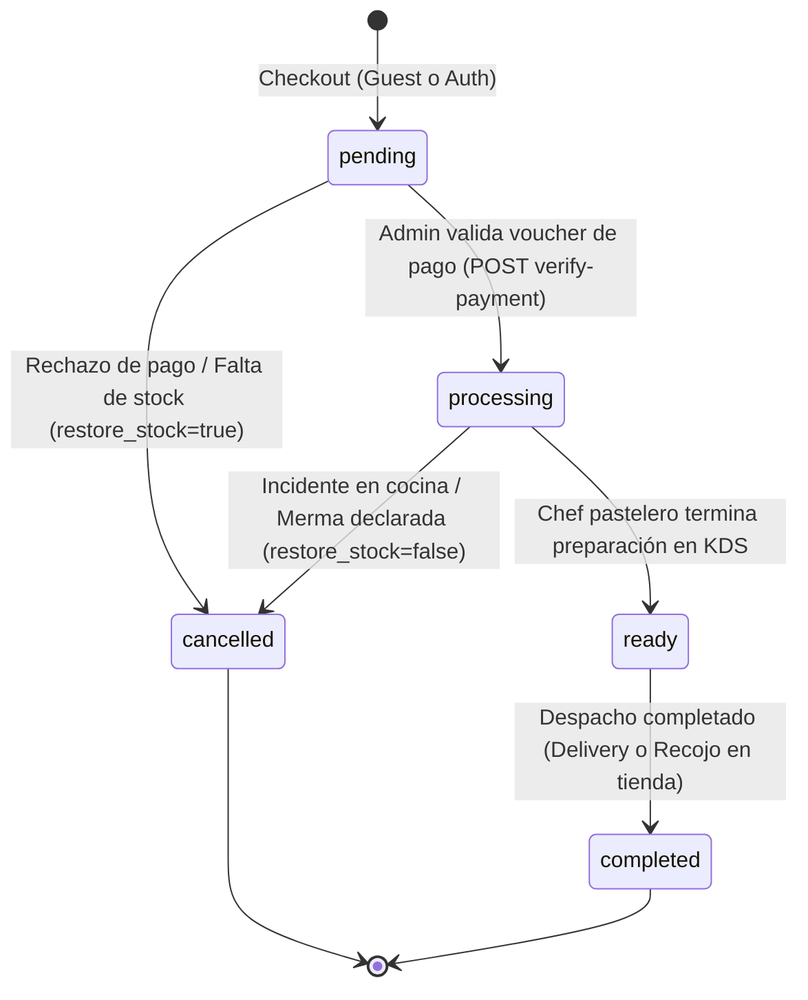
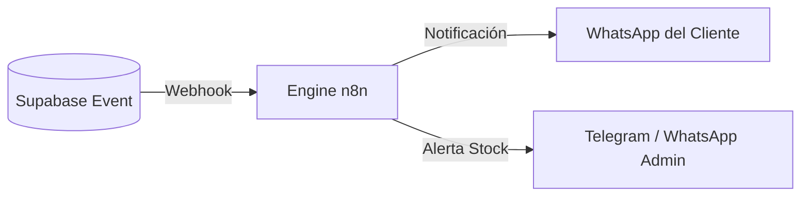

# 🍰 Lógica de Negocio & Ciclo de Vida de Pedidos — Dulce Fe

Este documento describe las **reglas de negocio operativas y financieras** que rigen el sistema de compras, la cocina de producción y las entregas de Dulce Fe.

---

## 🔄 1. Ciclo de Vida del Pedido (State Machine)

Cada orden creada en la tabla `orders` (documentada en [[esquema-base-datos]]) atraviesa una máquina de estados controlada tanto en la base de datos como en `server/utils/order-state-machine.ts`:

### Detalle de Estados y Acciones Técnicas:

1. **`pending` (Pendiente de Verificación):**
   * El cliente finaliza el checkout (soporta *Guest Checkout* según [[plan-maestro]]).
   * El cliente sube su voucher de pago Yape/Plin vía [[POST-api-checkout-upload-receipt]].
   * Se genera un token criptográfico HMAC-SHA256 para seguimiento en tiempo real vía [[GET-api-orders-track-token]] (`/pedido/[token]`).
   * Se emite un webhook seguro a **n8n** con cabecera `X-DulceFe-Signature` para confirmación preliminar por WhatsApp.

2. **`processing` (En Cocina / KDS):**
   * El administrador confirma el pago mediante [[POST-api-admin-orders-id-verify-payment]] (`payment_status = 'verified'`).
   * El pedido ingresa inmediatamente a la pantalla de cocina [[GET-api-admin-kds-orders]] (`/admin/kds`) con semáforos de urgencia calculados en hora local de Lima.
   * **Congelamiento de Costos (COGS Freeze):** Se toma un snapshot inmutable de las recetas y costos de materias primas actuales en `order_items.unit_cost` y `order_items.cost_snapshot` ([[ADR-008-recipe-versioning]]).
   * **Deducción de Inventario:** El stock físico de materias primas y empaques se deduce mediante trigger atómico en base de datos.

3. **`ready` (Listo para Entrega):**
   * El equipo de cocina marca el pedido como listo en el KDS o el administrador en la pestaña de pedidos.
   * n8n dispara alerta al cliente por WhatsApp: *"¡Tu postre está listo para recojo o en camino a tu dirección!"*.

4. **`completed` (Entregado / Cerrado):**
   * Cierre formal de la venta. Si el cliente está autenticado, se acumulan sus puntos en `profiles.points`.
   * El pedido se convierte en un registro histórico inmutable ([[ADR-007-completed-order-immutability]]).

5. **`cancelled` (Cancelado):**
   * Si la cancelación ocurre antes de procesar (`pending -> cancelled`), se ejecuta la reversión de stock automática (`restore_stock = true`) a través de la RPC `revert_order_inventory` ([[ADR-001-cancellation-stock-reversal]]).
   * Si la cancelación ocurre durante la producción (`processing -> cancelled`), se declara como merma culinaria sin restaurar el insumo físico (`restore_stock = false`).

---

## 💰 2. Reglas Financieras de Costeo y Precios

El cálculo del precio de venta sugerido se rige por las 4 capas de [[formulas-costeo]]:

$$\text{Costo Total} = \sum (\text{Costo Insumos}) + \text{Empaque} + \text{Servicios (CIF)} + \text{Mano de Obra}$$

$$\text{Margen Bruto \%} = \left( \frac{\text{Precio Venta} - \text{Costo Total}}{\text{Precio Venta}} \right) \times 100$$

### Semáforo de Rentabilidad para el Administrador:
* 🟢 **Verde (> 45% Margen):** Postre altamente rentable (Producto Estrella).
* 🟡 **Amarillo (25% - 44% Margen):** Margen aceptable pero vulnerable a alzas de insumos.
* 🔴 **Rojo (< 25% Margen):** Alerta crítica de precio bajo o costo inflado.

---

## 🤖 3. Automatizaciones con n8n (Ecosistema Conectado)

1. **Alerta de Stock Crítico:** Si `raw_materials.stock` cae por debajo del umbral mínimo, n8n envía alerta al encargado de compras.
2. **Mensajería de Tracking:** Todo cambio de estado en la BD actualiza la vista pública `/pedido/[orderId]` y envía un mensaje con enlace directo.
