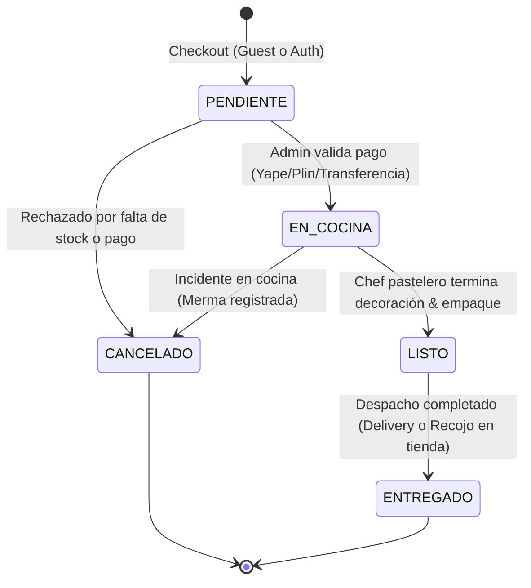
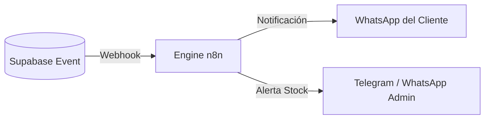

# 🍰 Lógica de Negocio & Ciclo de Vida de Pedidos — Dulce Fe

Este documento describe las **reglas de negocio operativas y financieras** que rigen el sistema de compras, la cocina de producción y las entregas de Dulce Fe.

---

## 🔄 1. Ciclo de Vida del Pedido (State Machine)

Cada orden creada en la tabla `orders` (documentada en [[esquema-base-datos]]) atraviesa una máquina de estados controlada:

### Detalle de Estados y Acciones Automáticas:

1. **`PENDIENTE`:**
   * El cliente finaliza el checkout (no requiere cuenta obligatoria; soporta *Guest Checkout* según [[plan-maestro]]).
   * Se genera un código amigable de rastreo (ej. `DF-4821`).
   * Se emite un webhook a **n8n** para enviar mensaje de confirmación preliminar por WhatsApp.
2. **`EN_COCINA` (KDS):**
   * El administrador confirma el pago.
   * El pedido aparece inmediatamente en la pantalla de cocina (KDS).
   * **Deducción de Stock:** Se descuentan las unidades de producto o los insumos calculados en [[formulas-costeo]].
3. **`LISTO`:**
   * La cocina finaliza la preparación y el empaquetado.
   * n8n dispara alerta al cliente: *"¡Tu postre está listo para recojo o en camino!"*.
4. **`ENTREGADO`:**
   * Cierre formal de la venta. Si el cliente está registrado, se acumulan sus puntos en `profiles.points`.

---

## 💰 2. Reglas Financieras de Costeo y Precios

El cálculo del precio de venta sugerido se rige por las 4 capas de [[formulas-costeo]]:

$$\text{Costo Total} = \sum (\text{Costo Insumos}) + \text{Empaque} + \text{Servicios (CIF)} + \text{Mano de Obra}$$

$$\text{Margen Bruto \%} = \left( \frac{\text{Precio Venta} - \text{Costo Total}}{\text{Precio Venta}} \right) \times 100$$

### Semáforo de Rentabilidad para el Administrador:
* 🟢 **Verde (> 45% Margen):** Postre altamente rentable (Producto Estrella).
* 🟡 **Amarillo (25% - 44% Margen):** Margen aceptable pero vulnerable a alzas de insumos.
* 🔴 **Rojo (< 25% Margen):** Alerta crítica de precio bajo o costo inflado.

---

## 🤖 3. Automatizaciones con n8n (Ecosistema Conectado)

1. **Alerta de Stock Crítico:** Si `raw_materials.stock` cae por debajo del umbral mínimo, n8n envía alerta al encargado de compras.
2. **Mensajería de Tracking:** Todo cambio de estado en la BD actualiza la vista pública `/pedido/[orderId]` y envía un mensaje con enlace directo.
