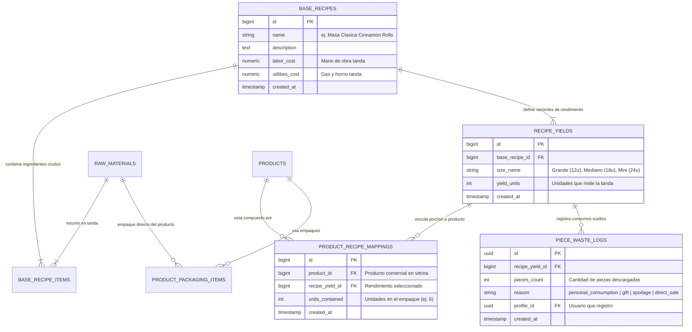

# 🧁 Plan Maestro: Tandas (Batch Recipes), Rendimientos (Yield), Porcionamiento y Vitrina A Pedido

> **Estado:** Documentado para ejecución incremental por fases.  
> **Propósito:** Resolver la brecha gastronómica entre la producción por lotes/tandas (ej. masa de roles de canela) y la venta de productos comerciales (ej. caja de 6 roles), automatizando el costeo, la deducción de insumos por piezas sueltas y el catálogo artesanal bajo demanda.

---

## 📋 Tabla de Contenidos

1. [[#1. Diagnóstico y Factores Decisivos (SSOT)|1. Diagnóstico y Factores Decisivos (SSOT)]]
2. [[#2. Modelo Matemático y Algoritmos Financieros|2. Modelo Matemático y Algoritmos Financieros]]
3. [[#3. Arquitectura de Datos (PostgreSQL / Supabase)|3. Arquitectura de Datos (PostgreSQL / Supabase)]]
4. [[#4. Especificación Paso a Paso por Fases|4. Especificación Paso a Paso por Fases]]
5. [[#5. Módulo de Descargo Rápido por Piezas (Cero Cálculos Manuales)|5. Módulo de Descargo Rápido por Piezas]]
6. [[#6. Vitrina y Dashboard: Modelo Artesanal "A Pedido"|6. Vitrina y Dashboard: Modelo Artesanal "A Pedido"]]
7. [[#7. Hoja de Ruta: Tienda de Puntos (Fidelización)|7. Hoja de Ruta: Tienda de Puntos (Fidelización)]]

---

## 1. Diagnóstico y Factores Decisivos (SSOT)

En la pastelería artesanal **a pedido (Make to Order)**, la producción no se inicia desde cero por cada postre vendido ni existen productos acumulados en estantes:
1. **Producción por Tandas (Batches):** El pastelero elabora una masa completa de una receta base (ej. 1 kg de harina, 200g mantequilla, levadura, gas de horneado).
2. **Variabilidad de Rendimiento (Yield):** De una misma tanda de masa surgen distintos cortes y tamaños (ej. 12 roles grandes, 18 roles medianos o 24 mini).
3. **Presentación Comercial (Kits de Venta):** El cliente compra cajas o unidades terminadas (ej. *"Caja de 6 Roles Medianos"*), que además consumen insumos propios de empaque (caja de cartón, cinta, sticker).
4. **Consumos Fuera de la App / Mermas:** Cuando el pastelero consume, regala o pierde piezas sueltas (ej. 2 roles), el sistema debe calcular y descontar los insumos automáticamente sin exigir cálculos matemáticos manuales.
5. **Alineación con ADRs Existentes:**
   - **ADR-008 (COGS Freeze):** Al pasar a `processing`, se toma un snapshot inmutable en `orders.cost_snapshot`. El nuevo motor debe registrar el desglose proporcional en céntimos enteros.
   - **ADR-001 (No reversión automática):** El stock deducido tras entrar a taller no se devuelve automáticamente si hay cancelación.
   - **ADR-004 (Desacoplamiento de stock de vitrina):** En un negocio a pedido no existen avisos de "quedan 2 unidades". Los postres están disponibles bajo demanda y se pausan con un interruptor on/off.

---

## 2. Modelo Matemático y Algoritmos Financieros

### A. Costo de la Tanda Base ($C_{\text{batch}}$)
$$C_{\text{batch}} = \sum_{i=1}^{k} (Q_i \times \text{costo\_unitario}_i) + \text{CIF}_{\text{batch}}$$
- $Q_i$: Cantidad del insumo $i$ en la tanda (ej. 1000g de harina, 200g mantequilla).
- $\text{costo\_unitario}_i$: Costo por gramo o mililitro según `raw_materials`.
- $\text{CIF}_{\text{batch}}$: Costos indirectos de fabricación de la tanda (gas de horneado, electricidad, mano de obra).

### B. Costo por Pieza según Rendimiento ($C_{\text{unit}}$)
Si la tanda completa rinde $Y$ piezas según el corte:
$$C_{\text{unit}} = \frac{C_{\text{batch}}}{Y}$$
*Ejemplo numérico:*
- Si la tanda cuesta **S/ 36.00**:
  - Corte Grande ($Y = 12$): $\text{Costo Unitario} = \frac{36}{12} = \text{S/ 3.00}$ por rol.
  - Corte Mediano ($Y = 18$): $\text{Costo Unitario} = \frac{36}{18} = \text{S/ 2.00}$ por rol.
  - Corte Mini ($Y = 24$): $\text{Costo Unitario} = \frac{36}{24} = \text{S/ 1.50}$ por rol.

### C. Costo del Producto Comercial ($C_{\text{producto}}$)
Un producto comercial (ej. *"Caja de 6 Roles Medianos"*) contiene $U$ unidades + empaques:
$$C_{\text{producto}} = \left( U \times C_{\text{unit}} \right) + \sum \text{Costo Empaques} = \left( \frac{U}{Y} \times C_{\text{batch}} \right) + \sum \text{Costo Empaques}$$
*Ejemplo numérico:*
- $6 \times \text{S/ 2.00} + \text{S/ 2.50 (Caja + Cinta)} = \text{S/ 14.50}$.
- Precio de venta: **S/ 28.00**.
- **Margen Bruto:** $\text{S/ 28.00} - \text{S/ 14.50} = \text{S/ 13.50}$ ($48.2\%$).

### D. Deducción Automática de Materias Primas en Almacén
Al venderse o consumirse $P$ piezas o productos:
$$\text{Cantidad a Descontar}_i = \text{Cantidad en Tanda}_i \times \left( \frac{U \times P}{Y} \right)$$
*Ejemplo:*
Para 1 caja de 6 roles medianos ($U=6, Y=18 \implies \text{fracción} = 1/3$):
- Harina: $1000\text{g} \times \frac{1}{3} = 333.33\text{g}$.
- Mantequilla: $200\text{g} \times \frac{1}{3} = 66.67\text{g}$.
- Empaque directo: 1 Caja de cartón para 6 roles.

---

## 3. Arquitectura de Datos (PostgreSQL / Supabase)

---

## 4. Especificación Paso a Paso por Fases

### 🧱 FASE 1: Base de Datos y Tipos TypeScript
- **Script SQL:** `supabase/migrations/20260922000001_batch_recipes_and_yields.sql`
- **Tablas:** `base_recipes`, `base_recipe_items`, `recipe_yields`, `product_recipe_mappings`, `product_packaging_items`, `piece_waste_logs`.
- **Seguridad RLS:** Restringido a administradores autenticados (`is_admin() = true`).
- **Tipado:** Actualizar `app/types/database.types.ts` y crear `app/types/batch-recipe.ts`.

### ⚙️ FASE 2: Backend Nitro y Servicios (`server/`)
- **Controlador de Tandas:** `server/services/batch-recipe.service.ts` con cálculo matemático en céntimos enteros.
- **Deducción de Inventario en Pedidos:** Actualizar `order.service.ts` para que al pasar a `processing` descuente insumos porcionados ($\frac{U}{Y} \times \text{tanda}$) y genere el `cost_snapshot` con trazabilidad completa.
- **Endpoints:**
  - `GET /api/admin/batch-recipes`: Listar tandas con costos.
  - `POST /api/admin/batch-recipes`: Crear tanda con rendimientos.
  - `PUT /api/admin/batch-recipes/[id]`: Modificar tanda.
  - `DELETE /api/admin/batch-recipes/[id]`: Eliminar tanda.
  - `POST /api/admin/product-recipes/mapping`: Asignar porciones y empaques a un producto comercial.
  - `POST /api/admin/batch-recipes/quick-deduction`: Registrar descargo de piezas sueltas.
  - `GET /api/admin/dashboard/at-risk-products`: Evaluar productos cuyos insumos requeridos están en stock crítico.

### 🎨 FASE 3: Interfaz Administrativa (UI / UX)
- **Modal de Tandas:** `app/components/admin/BatchRecipeModal.vue` con simulador de rendimientos y costos por pieza en tiempo real.
- **Modal de Descargo Rápido:** `app/components/admin/QuickPieceDeductionModal.vue` de 1 solo paso.
- **Pestaña de Recetas:** `app/components/admin/AdminRecipesTab.vue` adaptada para gestionar tanto recetas directas como tandas porcionadas.
- **Pestaña de Productos:** `app/components/admin/AdminProductsTab.vue` con switch Disponible/Pausado en lugar de exigir stock ficticio.

### 🛍️ FASE 4: Dashboard y Vitrina Comercial
- **Dashboard:** `app/components/admin/AdminDashboardTab.vue` sustituye *"Productos por agotarse (stock ficticio)"* por **"Productos en Riesgo por Falta de Insumos"**, con botón directo para pausar de vitrina o ir a reponer al almacén.
- **Vitrina Comercial:** `app/pages/menu.vue` y `app/components/catalog/ProductCard.vue` muestran badges de frescura (🟢 **"Hecho a Pedido"**) y tiempos de anticipación, retirando avisos engañosos de escasez retail.

### 🧪 FASE 5: Pruebas Automatizadas (Cero Regresiones)
- `tests/unit/batch-recipe-math.test.ts`: Exactitud de cálculos en céntimos y redondeo a 4 decimales.
- `tests/unit/quick-piece-deduction.test.ts`: Deducción proporcional y generación de movimientos de kardex.
- `tests/unit/at-risk-products.test.ts`: Detección preventiva de postres con insumos insuficientes.
- Mantener los 213 tests existentes del proyecto 100% en verde.

### 🚀 FASE 6: Verificación de Producción
- Typecheck estricto (`npx nuxi typecheck`).
- Compilación de producción limpia (`npm run build`).

---

## 5. Módulo de Descargo Rápido por Piezas (Cero Cálculos Manuales)

Diseñado específicamente para eliminar la fricción del pastelero cuando una pieza se consume fuera de los pedidos web:
1. El usuario abre el modal **"Registrar Salida de Piezas"** desde Recetas o Almacén.
2. Selecciona la preparación: *Roles de Canela - Mediano*.
3. Ingresa la cantidad de piezas sueltas: **2**.
4. Selecciona el motivo con un clic:
   - 🍩 *Consumo personal / Compartido*
   - 🎁 *Muestra / Regalo a cliente*
   - 🔥 *Merma / Falla de horneado*
   - 💵 *Venta directa fuera de la app*
5. **El sistema calcula internamente:**
   $$\text{Insumo consumido} = \frac{2}{18} \times \text{Insumo en tanda}$$
   Descuenta los gramos de harina, mantequilla, etc., en `inventory_movements` sin que el usuario tenga que hacer ningún cálculo manual.

---

## 6. Vitrina y Dashboard: Modelo Artesanal "A Pedido"

1. **Vitrina Comercial:**
   - Se erradican avisos como *"¡Solo quedan 2!"* o *"Stock: 5"*.
   - Se muestra badge de alta gama: **"Hecho a Pedido (100% Fresco)"** y anticipación requerida (ej. *"Pídelo con 24h de anticipación"*).
2. **Dashboard Operativo:**
   - Panel de **"Productos en Riesgo por Falta de Insumos"**: Alerta temprana cuando la harina, mantequilla o cajas no alcancen para preparar un postre.
   - Pestaña de **"Pausados / Fuera de Vitrina"** para reactivar productos con un solo clic.

---

## 7. Hoja de Ruta: Tienda de Puntos (Fidelización)

*Nota: Planificado para la siguiente fase de desarrollo.*
- El sistema ya acumula 1 punto por cada sol gastado (`profiles.points` y `orders.points_awarded`).
- En la fase posterior se implementará:
  1. Catálogo público `/puntos` con recompensas canjeables (postres gratis, cupones).
  2. Aplicación de puntos en checkout como descuento monetario en soles.
