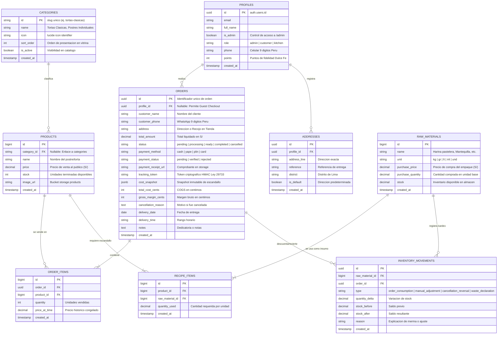

# 🗄️ Esquema de Base de Datos — Dulce Fe ERP & E-Commerce

Este documento define la **arquitectura relacional oficial y completa** de la base de datos de Dulce Fe en PostgreSQL / Supabase, asegurando total coherencia entre la capa de datos, los tipos de TypeScript (`app/types/database.types.ts`) y las políticas de seguridad Row Level Security (RLS).

---

## 📊 Diagrama Entidad-Relación Oficial (ERD)

---

## 🏛️ Catálogo de Tablas y Diccionario de Datos

### 1. Núcleo de Costeo & Escandallo (ERP)

Estas tablas alimentan las fórmulas matemáticas detalladas en [[formulas-costeo]].

#### `raw_materials` (Almacén de Materias Primas)
Almacena insumos comprados al por mayor con su respectivo costo de adquisición y unidad de medida.
* **`id`** (`BIGINT GENERATED BY DEFAULT AS IDENTITY`, PK)
* **`name`** (`VARCHAR(150)`, NOT NULL): Nombre del ingrediente (ej. *Harina sin preparar*, *Cobertura Bitter 70%*).
* **`unit`** (`VARCHAR(20)`, NOT NULL): Unidad de medida (`kg`, `gr`, `lt`, `ml`, `und`).
* **`purchase_price`** (`NUMERIC(10, 2)`, NOT NULL): Precio pagado por el volumen total en Soles (S/).
* **`purchase_quantity`** (`NUMERIC(10, 4)`, NOT NULL): Cantidad contenida en la presentación comprada.
* **`stock`** (`NUMERIC(10, 4)`, DEFAULT 0): Balance actual disponible en almacén.
* **`costo_unitario_calculado`** (Fórmula en runtime):
  $$\text{Costo Unitario} = \frac{\text{purchase\_price}}{\text{purchase\_quantity}}$$

#### `recipe_items` (Ficha Técnica / Escandallo)
Relaciona cada producto con los gramos o mililitros exactos que consume de cada materia prima.
* **`id`** (`BIGINT`, PK)
* **`product_id`** (`BIGINT REFERENCES products(id) ON DELETE CASCADE`, FK)
* **`raw_material_id`** (`BIGINT REFERENCES raw_materials(id) ON DELETE RESTRICT`, FK)
* **`quantity_used`** (`NUMERIC(10, 4)`, NOT NULL): Cantidad del insumo utilizada para producir una unidad del postre.

---

### 2. Catálogo Comercial (Storefront)

#### `categories` (Categorías Dinámicas de Catálogo)
Permite categorizar la vitrina desde base de datos según [[refinamiento-ui-auth-checkout-kds-informe]].
* **`id`** (`TEXT`, PK): Slug único (ej. `tortas-clasicas`, `postres-individuales`).
* **`name`** (`TEXT`, NOT NULL): Nombre visible en vitrina.
* **`icon`** (`TEXT`, DEFAULT `'lucide:sparkles'`, NOT NULL): Identificador de icono Lucide.
* **`sort_order`** (`INT`, DEFAULT 0, NOT NULL): Orden de presentación en el filtro.
* **`is_active`** (`BOOLEAN`, DEFAULT true, NOT NULL): Control de publicación.
* **`created_at`** (`TIMESTAMPTZ`, DEFAULT now())

#### `products` (Catálogo de Postres y Tortas)
* **`id`** (`BIGINT`, PK)
* **`category_id`** (`TEXT REFERENCES categories(id) ON DELETE SET NULL`, NULLABLE): Categoría asociada.
* **`name`** (`VARCHAR(200)`, NOT NULL): Título comercial (ej. *Torta Tres Leches Clásica*).
* **`price`** (`NUMERIC(10, 2)`, NOT NULL): Precio final de venta al cliente en Soles (S/).
* **`stock`** (`INT`, DEFAULT 0): Stock físico disponible para entrega inmediata.
* **`image_url`** (`TEXT`): Enlace público de la imagen alojada en el bucket `products` de Supabase Storage.
* **`created_at`** (`TIMESTAMPTZ`, DEFAULT now())

---

### 3. Clientes, Direcciones & Autenticación

#### `profiles` (Perfiles y Fidelización)
Mantiene los datos extendidos de los usuarios conectados con `auth.users` de Supabase.
* **`id`** (`UUID REFERENCES auth.users(id) ON DELETE CASCADE`, PK)
* **`email`** (`VARCHAR(255)`)
* **`full_name`** (`VARCHAR(200)`)
* **`is_admin`** (`BOOLEAN DEFAULT false`): Flag determinante para el acceso a `/admin` validado por la función `is_admin()`.
* **`role`** (`VARCHAR(50) DEFAULT 'customer'`): Roles: `admin`, `customer`, `kitchen`.
* **`phone`** (`VARCHAR(30)`): Teléfono móvil (9 dígitos Perú).
* **`points`** (`INT DEFAULT 0`): Puntos de fidelidad acumulados por compras.
* **`created_at`** (`TIMESTAMPTZ`, DEFAULT now())

#### `addresses` (Libreta de Direcciones de Cliente)
* **`id`** (`UUID DEFAULT gen_random_uuid()`, PK)
* **`profile_id`** (`UUID REFERENCES profiles(id) ON DELETE CASCADE`, FK)
* **`address_line`** (`TEXT`, NOT NULL): Dirección y número.
* **`reference`** (`TEXT`): Referencia para el repartidor.
* **`district`** (`VARCHAR(100)`, NOT NULL): Distrito de Lima metropolitana.
* **`is_default`** (`BOOLEAN DEFAULT false`): Marca si es la dirección predeterminada.
* **`created_at`** (`TIMESTAMPTZ`, DEFAULT now())

---

### 4. Ventas, Pedidos & Pagos (E-Commerce)

#### `orders` (Cabecera de Órdenes)
Soporta tanto **Guest Checkout (Clientes Invitados)** como **Clientes Registrados** ([[ADR-002-guest-checkout-auth-hibrida]]).
* **`id`** (`UUID DEFAULT gen_random_uuid()`, PK)
* **`profile_id`** (`UUID REFERENCES profiles(id) ON DELETE SET NULL`, NULLABLE): `NULL` si fue compra como invitado.
* **`customer_name`** (`TEXT`, NOT NULL)
* **`customer_phone`** (`TEXT`, NOT NULL): WhatsApp para notificaciones automáticas vía n8n.
* **`address`** (`TEXT`): Dirección de entrega o "Recojo en Tienda".
* **`total_amount`** (`NUMERIC(12, 2)`, NOT NULL): Monto total liquidado.
* **`status`** (`VARCHAR(50)`, DEFAULT `'pending'`): Estados canónicos:
  * `pending`: Registrado, esperando pago o confirmación.
  * `processing`: En cocina / producción (mise en place).
  * `ready`: Empacado y listo para despacho.
  * `completed`: Entregado al cliente con éxito.
  * `cancelled`: Cancelado con reversión atómica de stock o registro de merma.
* **`payment_method`** (`VARCHAR(20) DEFAULT 'cash'`): `cash`, `yape`, `plin`, `card`.
* **`payment_status`** (`VARCHAR(20) DEFAULT 'pending'`): `pending`, `verified`, `rejected`.
* **`payment_reference`** (`VARCHAR(100)`): Código de operación o referencia bancaria.
* **`payment_receipt_url`** (`TEXT`): URL pública del comprobante en bucket `payment-receipts`.
* **`payment_verified_at`** (`TIMESTAMPTZ`): Fecha y hora de validación en 1-click.
* **`payment_verified_by`** (`UUID REFERENCES profiles(id)`): Administrador que verificó el pago.
* **`tracking_token`** (`VARCHAR(64) UNIQUE`): Token HMAC-SHA256 para consulta pública sin login ([[ADR-002-guest-order-tracking]]).
* **`cost_snapshot`** (`JSONB`): Snapshot inmutable del escandallo y COGS congelado ([[ADR-008-recipe-versioning]]).
* **`total_cost_cents`** (`INTEGER`): Costo total de bienes vendidos (COGS) en céntimos.
* **`gross_margin_cents`** (`INTEGER`): Margen bruto en céntimos (`total_amount_cents - total_cost_cents`).
* **`cancellation_reason`** (`TEXT`): Motivo registrado en cancelaciones.
* **`inventory_processed`** (`BOOLEAN DEFAULT false`): Marca si los insumos fueron descontados en cocina.
* **`points_awarded`** (`BOOLEAN DEFAULT false`): Marca si los puntos de fidelidad fueron acreditados.
* **`delivery_date`** (`DATE`): Fecha programada de entrega.
* **`delivery_time`** (`VARCHAR(50)`): Rango horario (ej. *15:00 - 18:00*).
* **`notes`** (`TEXT`): Dedicatoria o instrucciones especiales.
* **`created_at`** (`TIMESTAMPTZ DEFAULT now()`)

#### `order_items` (Detalle de Productos Comprados)
* **`id`** (`BIGINT GENERATED BY DEFAULT AS IDENTITY`, PK)
* **`order_id`** (`UUID REFERENCES orders(id) ON DELETE CASCADE`, FK)
* **`product_id`** (`BIGINT REFERENCES products(id) ON DELETE RESTRICT`, FK)
* **`quantity`** (`INT NOT NULL CHECK (quantity > 0)`)
* **`price_at_time`** (`NUMERIC(12, 2) NOT NULL CHECK (price_at_time >= 0)`): Precio unitario congelado.
* **`created_at`** (`TIMESTAMPTZ DEFAULT now()`)

---

### 5. Kardex, Idempotencia & Auditoría Interna

#### `inventory_movements` (Libro Contable de Movimientos de Insumos)
* **`id`** (`UUID PRIMARY KEY DEFAULT gen_random_uuid()`)
* **`raw_material_id`** (`BIGINT REFERENCES raw_materials(id) ON DELETE RESTRICT`, FK)
* **`order_id`** (`UUID REFERENCES orders(id) ON DELETE SET NULL`, FK, NULLABLE)
* **`type`** (`TEXT NOT NULL CHECK (type IN ('order_consumption', 'manual_adjustment', 'cancellation_reversal', 'waste_declaration'))`)
* **`quantity_delta`** (`NUMERIC(14, 4) NOT NULL`): Variación neta (negativa para consumo, positiva para reposición).
* **`stock_before`** (`NUMERIC(14, 4) NOT NULL`): Saldo anterior al movimiento.
* **`stock_after`** (`NUMERIC(14, 4) NOT NULL`): Saldo resultante.
* **`reason`** (`TEXT`): Motivo descriptivo (ej. cancelación de pedido, ajuste por inventario físico, merma por rotura).
* **`actor_id`** (`UUID`): Usuario o administrador responsable.
* **`request_id`** (`TEXT`): ID de correlación HTTP.
* **`created_at`** (`TIMESTAMPTZ DEFAULT now()`)

#### `checkout_idempotency_keys` (Protección contra Doble Cobro - TTL 24h)
* **`operation`** (`TEXT`), **`principal_scope`** (`TEXT`), **`key`** (`TEXT`) (PK Compuesta)
* **`request_hash`** (`TEXT NOT NULL`): Hash SHA-256 del cuerpo de la petición.
* **`order_id`** (`UUID REFERENCES orders(id) ON DELETE CASCADE`)
* **`lifecycle`** (`TEXT CHECK (lifecycle IN ('processing', 'completed'))`)
* **`status_code`** (`INT DEFAULT 201`)
* **`response_payload`** (`JSONB`)
* **`created_at`** (`TIMESTAMPTZ DEFAULT now()`), **`expires_at`** (`TIMESTAMPTZ NOT NULL`)

#### `audit_events` (Bitácora Inmutable de Operaciones Críticas sin PII)
* **`id`** (`UUID PRIMARY KEY DEFAULT gen_random_uuid()`)
* **`actor_id`** (`UUID`): ID del usuario que ejecutó la acción.
* **`action`** (`TEXT NOT NULL`): Acciones registradas (`checkout.create`, `order.create_admin`, `order.status`, `product.write`, `material.write`, `recipe.write`, `upload.write`, `stock.adjust`, `payment.verify`, `payment.verified`, `payment.rejected`).
* **`entity`** (`TEXT NOT NULL`), **`entity_id`** (`TEXT`), **`result`** (`TEXT CHECK (result IN ('ok', 'error'))`)
* **`request_id`** (`TEXT`), **`created_at`** (`TIMESTAMPTZ DEFAULT now()`)

---

## 🔐 Seguridad y Matriz Row Level Security (RLS)

Todas las políticas de seguridad están versionadas en `supabase/migrations/` y aplicadas en producción:

| Tabla / Recurso | Lectura (`SELECT`) | Escritura / Mutación (`INSERT`, `UPDATE`, `DELETE`) |
| :--- | :--- | :--- |
| `categories` | 🌐 **Pública** (`is_active = true`) | 🔒 **Solo Admin** (`is_admin() = true`) |
| `products` | 🌐 **Pública** (Cualquier visitante ve la vitrina) | 🔒 **Solo Admin** (`is_admin() = true`) |
| `raw_materials` | 🔒 **Solo Admin** | 🔒 **Solo Admin** |
| `recipe_items` | 🔒 **Solo Admin** | 🔒 **Solo Admin** |
| `profiles` | 👤 Propietario (`auth.uid() = id`) o 🔒 Admin | 👤 Propietario o 🔒 Admin |
| `addresses` | 👤 Propietario (`auth.uid() = profile_id`) | 👤 Propietario |
| `orders` | 👤 Propietario o 🔒 Admin (Invitados consultan vía `/api/orders/track/:token`) | 🌐 Inserción vía endpoint de checkout / Mutación de estado solo Admin |
| `order_items` | 👤 Propietario de la orden o 🔒 Admin | 🔒 Solo backend transaccional |
| `inventory_movements` | 🔒 **Solo Admin** / Service Role | 🔒 **Solo Service Role** (Inmutable) |
| `checkout_idempotency_keys` | 🔒 **Solo Service Role** | 🔒 **Solo Service Role** |
| `checkout_rate_windows` | 🔒 **Solo Service Role** | 🔒 **Solo Service Role** |
| `audit_events` | 🔒 **Solo Service Role** | 🔒 **Solo Service Role** (Append-only) |
| **Bucket `products`** | 🌐 **Pública** (Imágenes de tortas) | 🔒 **Solo Admin** (Validación Magic Bytes) |
| **Bucket `payment-receipts`**| 🌐 **Pública para comprobantes** | 🔒 **Solo Service Role** (Validación Magic Bytes) |

---

## 🔗 Documentos y Migraciones Relacionadas
- Fórmulas de cálculo de costo por gramo y margen: [[formulas-costeo]]
- Catálogo de endpoints API: [[api-endpoints]]
- Arquitectura de componentes de interfaz: [[componentes-arquitectura]]
- Guía de diseño móvil responsivo: [[guia-diseno-mobile-responsivo]]
- Archivo histórico de scripts y gobernanza: [[sql/README]]

