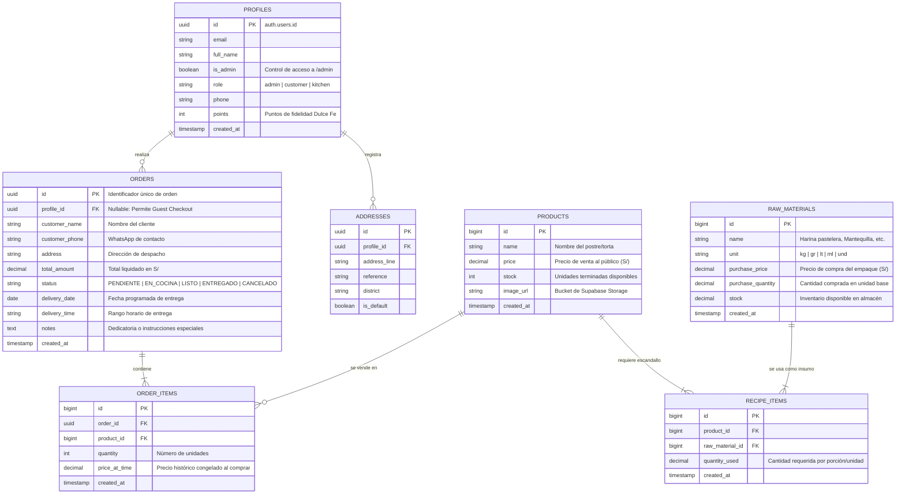

# 🗄️ Esquema de Base de Datos — Dulce Fe ERP & E-Commerce

Este documento define la **arquitectura relacional oficial** de la base de datos de Dulce Fe en PostgreSQL / Supabase, asegurando consistencia entre la capa de datos, los tipos de TypeScript (`app/types/database.types.ts`) y las políticas de seguridad RLS.

---

## 📊 Diagrama Entidad-Relación Oficial (ERD)

---

## 🏛️ Catálogo de Tablas y Diccionario de Datos

### 1. Núcleo de Costeo & Escandallo (ERP)

Estas tablas alimentan las fórmulas matemáticas detalladas en [[formulas-costeo]].

#### `raw_materials` (Almacén de Materias Primas)
Almacena insumos comprados al por mayor con su respectivo costo de adquisición y unidad de medida.
* **`id`** (`BIGINT GENERATED BY DEFAULT AS IDENTITY`, PK)
* **`name`** (`VARCHAR(150)`, NOT NULL): Nombre del ingrediente (ej. *Harina sin preparar*, *Cobertura Bitter 70%*).
* **`unit`** (`VARCHAR(20)`, NOT NULL): Unidad de medida (`kg`, `gr`, `lt`, `ml`, `und`).
* **`purchase_price`** (`NUMERIC(10, 2)`, NOT NULL): Precio pagado por el volumen total.
* **`purchase_quantity`** (`NUMERIC(10, 4)`, NOT NULL): Cantidad contenida en la presentación comprada.
* **`stock`** (`NUMERIC(10, 4)`, DEFAULT 0): Balance actual en almacén.
* **`costo_unitario_calculado`** (Fórmula en runtime):
  $$\text{Costo Unitario} = \frac{\text{purchase\_price}}{\text{purchase\_quantity}}$$

#### `recipe_items` (Ficha Técnica / Escandallo)
Relaciona cada producto con los gramos o mililitros exactos que consume de cada materia prima.
* **`id`** (`BIGINT`, PK)
* **`product_id`** (`BIGINT REFERENCES products(id) ON DELETE CASCADE`, FK)
* **`raw_material_id`** (`BIGINT REFERENCES raw_materials(id) ON DELETE RESTRICT`, FK)
* **`quantity_used`** (`NUMERIC(10, 4)`, NOT NULL): Cantidad del insumo utilizada para producir una unidad del postre.

---

### 2. Catálogo Comercial (Storefront)

#### `products` (Catálogo de Postres y Tortas)
* **`id`** (`BIGINT`, PK)
* **`name`** (`VARCHAR(200)`, NOT NULL): Título comercial (ej. *Torta Tres Leches Clásica*).
* **`price`** (`NUMERIC(10, 2)`, NOT NULL): Precio final de venta al cliente en Soles (S/).
* **`stock`** (`INT`, DEFAULT 0): Stock físico disponible para entrega inmediata.
* **`image_url`** (`TEXT`): Enlace público de la imagen alojada en Supabase Storage.

---

### 3. Clientes & Autenticación

#### `profiles` (Perfiles y Fidelización)
Mantiene los datos extendidos de los usuarios registrados conectados con `auth.users` de Supabase.
* **`id`** (`UUID REFERENCES auth.users(id) ON DELETE CASCADE`, PK)
* **`email`** (`VARCHAR(255)`)
* **`full_name`** (`VARCHAR(200)`)
* **`is_admin`** (`BOOLEAN DEFAULT false`): Flag determinante para el acceso a `/admin` validado por la función `is_admin()`.
* **`role`** (`VARCHAR(50) DEFAULT 'customer'`): Roles soportados: `admin`, `customer`, `kitchen`.
* **`points`** (`INT DEFAULT 0`): Sistema de puntos de fidelidad acumulados por compras.

---

### 4. Ventas & Pedidos (E-Commerce)

#### `orders` (Cabecera de Órdenes)
Soporta tanto **Guest Checkout (Clientes Invitados)** como **Clientes Registrados** (según diseño en [[plan-maestro]]).
* **`id`** (`UUID DEFAULT gen_random_uuid()`, PK)
* **`profile_id`** (`UUID REFERENCES profiles(id) ON DELETE SET NULL`, NULLABLE): Si es `NULL`, la compra fue efectuada en modo invitado.
* **`customer_name`** (`VARCHAR(200)`, NOT NULL)
* **`customer_phone`** (`VARCHAR(30)`, NOT NULL): Teléfono para notificaciones de WhatsApp vía n8n.
* **`address`** (`TEXT`): Dirección de entrega o "Recojo en Tienda".
* **`total_amount`** (`NUMERIC(10, 2)`, NOT NULL): Monto total liquidado.
* **`status`** (`VARCHAR(50)`, DEFAULT `'PENDIENTE'`): Estados posibles:
  * `PENDIENTE`: Registrado por el cliente, esperando confirmación.
  * `EN_COCINA`: Aprobado y en proceso de horneado/elaboración.
  * `LISTO`: Empacado y listo para despacho o recojo.
  * `ENTREGADO`: Orden completada con éxito.
  * `CANCELADO`: Anulado con reincorporación de stock.
* **`delivery_date`** (`DATE`): Fecha programada de entrega.
* **`delivery_time`** (`VARCHAR(50)`): Rango horario (ej. *15:00 - 18:00*).

#### `order_items` (Detalle de Productos Comprados)
* **`id`** (`BIGINT`, PK)
* **`order_id`** (`UUID REFERENCES orders(id) ON DELETE CASCADE`, FK)
* **`product_id`** (`BIGINT REFERENCES products(id) ON DELETE RESTRICT`, FK)
* **`quantity`** (`INT`, NOT NULL)
* **`price_at_time`** (`NUMERIC(10, 2)`, NOT NULL): Precio unitario congelado al momento exacto de la compra.

---

## 🔐 Seguridad y Row Level Security (RLS)

Todas las políticas de seguridad están versionadas en `supabase/migrations/20260826000001_phase1_security_rls.sql` y validadas en [[fase-1-pr-1c-informe-ejecucion]]:

| Tabla | Lectura (`SELECT`) | Escritura / Mutación (`INSERT`, `UPDATE`, `DELETE`) |
| :--- | :--- | :--- |
| `products` | 🌐 **Pública** (Cualquier visitante puede ver el catálogo) | 🔒 **Solo Admin** (`is_admin() = true`) |
| `raw_materials` | 🔒 **Solo Admin** | 🔒 **Solo Admin** |
| `recipe_items` | 🔒 **Solo Admin** | 🔒 **Solo Admin** |
| `profiles` | 👤 Propietario (`auth.uid() = id`) o 🔒 Admin | 👤 Propietario o 🔒 Admin |
| `orders` | 👤 Propietario o 🔒 Admin | 🌐 Creación pública (Guest Checkout) / Mutación de estado solo Admin |

---

## 🔗 Documentos y Migraciones Relacionadas
- Fórmulas de cálculo de costo por gramo y margen: [[formulas-costeo]]
- Arquitectura de componentes de interfaz: [[componentes-arquitectura]]
- Archivo histórico de scripts: [[sql/README]]
