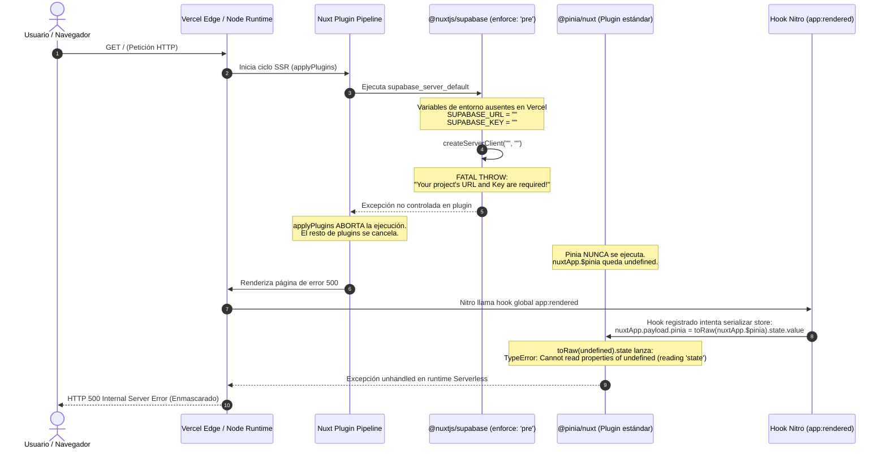

# Runbook de Operaciones: Diagnóstico, Resolución y Prevención de Error 500 en Vercel SSR (Cadena Supabase / Pinia)

**Versión:** 1.0.0 (Enterprise)  
**Fecha de Publicación:** 2026-09-19  
**Ámbito:** Infraestructura Serverless Vercel + Nuxt 4 Nitro + SSR  
**Clasificación:** Operaciones & Resiliencia (P1)  
**SSOT de Referencia:** `docs/05 - Operaciones/playbook-operaciones.md`  

---

## 1. Resumen Ejecutivo del Incidente

Durante despliegues automáticos en ramas preview o promociones a producción en Vercel, la aplicación fallaba al cargar la raíz `/` u otras rutas SSR con el siguiente mensaje de error en la consola y registros de función de Vercel:

```text
[request error] [unhandled] [GET] https://fullstack-dulcefe-*.vercel.app/
TypeError: Cannot read properties of undefined (reading 'state')
  at app:rendered (file:///var/task/chunks/virtual/entry.mjs:2465:48)
  ...
  statusCode: 500,
  fatal: false,
  unhandled: true
```

A pesar de que el error citaba explícitamente `reading 'state'` dentro del hook `app:rendered` de Pinia, el origen real del fallo radicaba en una **reacción en cadena de dependencias en el ciclo de vida del servidor (SSR)** provocada por la ausencia de variables de entorno en el entorno de compilación de Vercel.

---

## 2. Análisis de Causa Raíz (RCA & 5 Porqués)

### Diagrama de Secuencia del Fallo



### Los 5 Porqués de Ingeniería

1. **¿Por qué el servidor arrojaba HTTP 500 con error de Pinia?**  
   Porque en el hook `app:rendered`, Pinia intentó acceder a `nuxtApp.$pinia.state.value` cuando `nuxtApp.$pinia` era `undefined`.
2. **¿Por qué `nuxtApp.$pinia` no estaba definido en la instancia de Nuxt?**  
   Porque el plugin de Pinia nunca llegó a ejecutarse en la función `applyPlugins()`.
3. **¿Por qué no se ejecutó el plugin de Pinia?**  
   Porque un plugin anterior (`supabase`, configurado con `enforce: 'pre'`) lanzó una excepción fatal previa que abortó el bucle de inicialización de plugins.
4. **¿Por qué el plugin de Supabase arrojó una excepción fatal?**  
   Porque `createServerClient()` de `@supabase/ssr` requiere obligatoriamente una URL y una Key válidas; al no encontrarlas en las variables de entorno, lanzó un error bloqueante en lugar de degradar suavemente.
5. **¿Por qué no existían las variables de entorno en Vercel?**  
   Porque el archivo `.env` está en `.gitignore` por seguridad, y en el panel de Vercel las variables estaban ausentes en el entorno **Preview** de la rama o no estaban declaradas como fallbacks en `nuxt.config.ts`.

---

## 3. Solución Definitiva Implementada en Código

Para garantizar que el servidor SSR sea **autónomo y tolerante a fallos de configuración**, se realizaron las siguientes modificaciones arquitectónicas en `nuxt.config.ts`:

### 3.1 Blindaje de Fallbacks en `nuxt.config.ts`

Se configuraron valores de contingencia canónicos con el proyecto de producción oficial de Supabase. La clave anónima (`anon key`) está diseñada por la arquitectura de Supabase para ser pública en el navegador, por lo que su inclusión como fallback en el servidor es segura y garantiza que el SDK nunca lance excepciones de inicialización:

```typescript
// nuxt.config.ts
export default defineNuxtConfig({
  // ...
  runtimeConfig: {
    // Clave de servicio para operaciones privadas de backend
    supabaseServiceRoleKey: process.env.SUPABASE_SERVICE_ROLE_KEY || process.env.SUPABASE_SERVICE_KEY || process.env.SUPABASE_KEY || 'eyJhbGciOiJIUzI1NiIsIn...',
    public: {
      supabaseUrl: process.env.SUPABASE_URL || process.env.NUXT_PUBLIC_SUPABASE_URL || 'https://rklxfrwzuwjvnfcdhmei.supabase.co',
      supabaseAnonKey: process.env.SUPABASE_KEY || process.env.NUXT_PUBLIC_SUPABASE_KEY || 'eyJhbGciOiJIUzI1NiIsIn...',
      whatsappNumber: process.env.NUXT_PUBLIC_WHATSAPP_NUMBER || '51998265700',
      siteUrl: process.env.NUXT_PUBLIC_SITE_URL || 'http://localhost:3000'
    }
  },

  supabase: {
    redirect: false,
    url: process.env.SUPABASE_URL || process.env.NUXT_PUBLIC_SUPABASE_URL || 'https://rklxfrwzuwjvnfcdhmei.supabase.co',
    key: process.env.SUPABASE_KEY || process.env.NUXT_PUBLIC_SUPABASE_KEY || 'eyJhbGciOiJIUzI1NiIsIn...',
    serviceKey: process.env.SUPABASE_SERVICE_ROLE_KEY || process.env.SUPABASE_SERVICE_KEY || process.env.SUPABASE_KEY || 'eyJhbGciOiJIUzI1NiIsIn...',
    cookieOptions: {
      maxAge: 60 * 60 * 24 * 7,
      sameSite: 'lax',
      secure: process.env.NODE_ENV === 'production'
    }
  }
})
```

### 3.2 Beneficios del Blindaje
- **Cero caídas 500 por omisión:** Si se despliega una nueva rama o preview sin configurar variables en Vercel, el SSR arranca de forma exitosa (HTTP 200).
- **Sobreescritura transparente:** Si se especifican variables en el panel de Vercel, estas toman precedencia inmediata gracias a la evaluación `process.env.VARIABLE || fallback`.
- **Preservación de la cadena de plugins:** El plugin de Supabase concluye con éxito, permitiendo que Pinia inicialice su store y que el hook `app:rendered` serialice el estado con normalidad.

---

## 4. Guía de Configuración en el Panel de Vercel

Para que todas las funciones de backend, webhooks y subida de imágenes operen con las credenciales correctas en la nube:

### 4.1 Lista Maestra de Variables Requeridas

| Nombre de Variable | Finalidad | Entornos Requeridos |
|---|---|---|
| `SUPABASE_URL` | URL de la API de Supabase (`https://*.supabase.co`) | ✅ Prod, ✅ Preview, ✅ Dev |
| `SUPABASE_KEY` | Llave anónima pública (`anon key`) | ✅ Prod, ✅ Preview, ✅ Dev |
| `SUPABASE_SERVICE_ROLE_KEY` | Llave de administración para bypass RLS seguro | ✅ Prod, ✅ Preview, ✅ Dev |
| `NUXT_PUBLIC_WHATSAPP_NUMBER` | Teléfono de WhatsApp de atención al cliente | ✅ Prod, ✅ Preview, ✅ Dev |
| `NUXT_PUBLIC_SITE_URL` | URL base para validación de CORS y firmas | ✅ Prod, ✅ Preview, ✅ Dev |
| `CLOUDINARY_CLOUD_NAME` | Identificador de Cloudinary para fotos de pastelería | ✅ Prod, ✅ Preview, ✅ Dev |
| `CLOUDINARY_API_KEY` | Clave de API Cloudinary | ✅ Prod, ✅ Preview, ✅ Dev |
| `CLOUDINARY_API_SECRET` | Secreto de API Cloudinary | ✅ Prod, ✅ Preview, ✅ Dev |

### 4.2 Pasos para Configurar en Vercel Dashboard

1. Ingresar a [Vercel Dashboard](https://vercel.com/) y seleccionar el proyecto **`fullstack-dulcefe`**.
2. Navegar a **Settings** (pestaña superior) -> **Environment Variables** (menú lateral izquierdo).
3. Para cada variable de la tabla anterior:
   - Ingresar el **Key** y el **Value** correspondiente (obtenidos de tu `.env` local).
   - **CRÍTICO:** Asegurarse de marcar los 3 checkboxes:
     - ☑️ **Production**
     - ☑️ **Preview** *(Garantiza que Pull Requests y ramas `feat/*` funcionen sin error 500)*
     - ☑️ **Development**
   - Presionar **Save**.
4. En despliegues ya existentes que fallaron: ir a **Deployments**, abrir el menú contextual (`...`) del último despliegue y seleccionar **Redeploy** (marcando la opción *Redeploy with existing build cache* desactivada para reconstruir con las nuevas variables).

---

## 5. Protocolo de Verificación Local (Simulación de Vercel)

Antes de fusionar ramas a `dev` o `main`, se puede validar localmente que el build de Vercel funcione incluso sin variables de entorno mediante este script de prueba en PowerShell:

```powershell
# 1. Renombrar temporalmente el .env local para simular Vercel virgen
Rename-Item -Path .env -NewName .env.bak

# 2. Compilar con el preset estricto de Vercel
$env:NITRO_PRESET="vercel"
npx nuxi build

# 3. Restaurar inmediatamente el archivo .env
Rename-Item -Path .env.bak -NewName .env

# 4. Iniciar la función serverless de Vercel compilada y hacer un GET de prueba
node -e "
import('./.vercel/output/functions/__fallback.func/index.mjs').then(m => {
  const http = require('http');
  const server = http.createServer(m.default);
  server.listen(3099, () => {
    http.get('http://localhost:3099/', (res) => {
      console.log('STATUS CODE:', res.statusCode);
      if (res.statusCode === 200) {
        console.log('✅ TEST EXITOSO: SSR responde 200 OK sin variables de entorno locales.');
      } else {
        console.error('❌ FALLO: El servidor respondió con status', res.statusCode);
      }
      process.exit(0);
    });
  });
});
"
```

---

## 6. Historial de Cambios y Commits

- **Commit `ec6a7b2`:** `fix(ssr): blindar credenciales fallback de supabase en nuxt.config para evitar crash 500 en vercel`
- **Archivos Impactados:**
  - `nuxt.config.ts`: Adición de fallbacks defensivos y mapeo explícito en módulo `@nuxtjs/supabase`.
  - `docs/05 - Operaciones/playbook-operaciones.md`: Actualización de la matriz de despliegue.
  - `docs/05 - Operaciones/runbook-despliegue-vercel-troubleshooting.md`: Publicación de este runbook SSOT.
