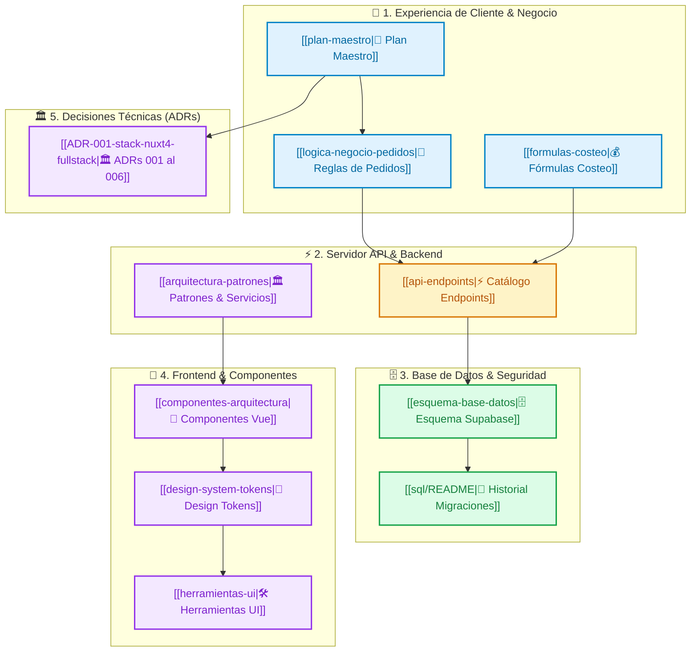

# 🍰 Dulce Fe — Centro de Comando

> **Estado:** 🟢 Fase 1 (Seguridad & RLS) | 🟢 Fase 2 (Shell Visual & Layouts) | 🟢 Fase 3 (Dinero, S9 & Servicios) | 🟢 Fase 4 (Desacoplamiento Modular UI) | 🟢 Fase 5 (Disciplina & Gobernanza Enterprise) | 🟢 Fase 6 (Expansión de Producto, KDS Taller, Pagos Digitales & Webhooks) | 🟢 Hardening & Estabilidad (Fix Modales, RLS Service Role & Sesiones Zombi)
> **Vista Gráfica:** Presiona `Ctrl + G` en Obsidian para el mapa global.

---

## 📊 Arquitectura del Ecosistema

---

## 🗂️ Índice de Documentación (Por Carpetas)

### 📁 01 - Estrategia & Negocio
* [[plan-maestro]] — Especificación general, arquitectura Nuxt 4, Guest Checkout y Roadmap.
* [[logica-negocio-pedidos]] — Ciclo de vida de órdenes, estados de cocina KDS y alertas n8n.
* [[formulas-costeo]] — Algoritmos de costeo en gramos/ml, CIF, mano de obra y margen.

### 📁 02 - Backend & Datos
* [[api-endpoints]] — **Catálogo Maestro de Endpoints API** (17 fichas técnicas individuales en `endpoints/`):
  * **Productos:** [[GET-api-products]], [[POST-api-products]], [[GET-api-products-id]], [[PUT-api-products-id]], [[DELETE-api-products-id]], [[POST-api-products-upload]].
  * **Materias Primas:** [[GET-api-raw-materials]], [[POST-api-raw-materials]], [[PUT-api-raw-materials-id]], [[DELETE-api-raw-materials-id]].
  * **Recetas & Excel:** [[GET-api-recipes-productId]], [[POST-api-recipes]], [[DELETE-api-recipes-id]], [[GET-api-recipes-export]].
  * **Carrito (Desactivado 410):** [[GET-api-cart]], [[POST-api-cart]], [[DELETE-api-cart-productId]].
  * **Checkout & Pedidos:** [[POST-api-checkout]], [[GET-api-admin-orders]], [[GET-api-admin-orders-id]], [[PATCH-api-admin-orders-id]], [[PATCH-api-admin-orders-id-status]], [[POST-api-admin-orders]].
* [[esquema-base-datos]] — Esquema relacional oficial, tablas `products`, `raw_materials`, `recipe_items`, `orders`, `profiles` y RLS.
* [[sql/README]] — Gobernanza de base de datos y archivo histórico.

### 📁 03 - Arquitectura & UI
* [[architecture-refactor-plan]] — Diagnóstico arquitectónico y plan de refactorización.
* [[arquitectura-patrones]] — Patrones de diseño aplicados y composables.
* [[componentes-arquitectura]] — Guía de estructuración de componentes Vue 3.
* [[design-system-tokens]] — Paleta de colores Dulce Fe, tipografía y bordes.
* [[herramientas-ui]] — Utilidades y librerías de UI (Lucide Icons, Toast, Modal).

### 📁 04 - Informes de Ejecucion
* [[fase-0-informe-ejecucion]] — Auditoría inicial de dependencias y variables de entorno.
* [[fase-1-pr-1a-informe-ejecucion]] — Cierre de vulnerabilidad S1 y desactivación 410 de carrito.
* [[fase-1-pr-1b-informe-ejecucion]] — Guards de servidor `require-user` y `require-admin` en 12 endpoints.
* [[fase-1-pr-1c-informe-ejecucion]] — Blindaje de `isAdmin` en Pinia y migración SQL de RLS en Supabase.
* [[fase-1-pr-1d-informe-ejecucion]] — Upload seguro con Magic Bytes, script `db:types` y suite de tests Vitest.
* [[fase-2-informe-ejecucion]] — Shell Visual, Design System, Layouts `default`/`admin` y Componentes Atómicos UI.
* [[fase-3-pr-3a-informe-ejecucion]] — Checkout Seguro, Idempotencia Concurrente, Dinero en Céntimos y Tablas de Apoyo.
* [[fase-3-pr-3b-informe-ejecucion]] — Frontend Seguro de Checkout, Composable `useCheckout` y Enlace Inviolable de WhatsApp.
* [[fase-3-pr-3c-informe-ejecucion]] — Transiciones de Estado, Pedidos de Administración y Quiebre de Inventario.
* [[fase-3-pr-3d-informe-ejecucion]] — Corte de Seguridad S9 en PostgreSQL y Revocación de RPCs.
* [[fase-3-pr-3e-informe-ejecucion]] — Servicios de Dominio de Catálogo, Insumos y Recetas con Auditoría.
* [[fase-4-pr-4a-informe-ejecucion]] — Desacoplamiento de Perfil de Usuario y Direcciones.
* [[fase-4-pr-4b-informe-ejecucion]] — Desacoplamiento de Catálogo y Carrito de Compras.
* [[fase-4-pr-4c-informe-ejecucion]] — Desacoplamiento de Materias Primas e Inventario.
* [[fase-4-pr-4d-informe-ejecucion]] — Desacoplamiento de Recetas y Costeo de Escandallo.
* [[fase-4-pr-4e-informe-ejecucion]] — Desacoplamiento de Pedidos Administrativos (Kanban y Modales).
* [[fase-4-pr-4f-checkout-y-refinamiento-10-10]] — Refinamiento Integral de Checkout UI y Certificación 10/10.
* [[fase-5-subfase-5.1-eslint-informe]] — ESLint 10 Flat Config y Erradicación Total de `any`.
* [[fase-5-subfase-5.2-limites-arquitectura-informe]] — Linter de Límites Arquitectónicos (§6.2).
* [[fase-5-subfase-5.3-ci-type-drift-informe]] — Pipeline CI/CD en GitHub Actions y Type Drift Gate.
* [[fase-5-subfase-5.4-adrs-informe]] — Formalización MADR 3.0.0 de Deudas Técnicas D1–D8.
* [[fase-5-subfase-5.5-operaciones-informe]] — Playbook de Operaciones, Resiliencia y Telemetría.
* [[fase-5-subfase-5.6-a11y-informe]] — Accesibilidad WCAG 2.1 AA en Formularios y Modales.
* [[fase-5-disciplina-informe-ejecucion]] — **Informe Maestro Consolidado de Fase 5**.
* [[fase-6-subfase-6.1-tracking-invitados-informe]] — Guest Tracking sin cuenta, Tokens HMAC-SHA256 y Ley 29733 (ADR-002 / D2).
* [[fase-6-subfase-6.2-reversion-stock-mermas-informe]] — Reversión Atómica de Stock y Declaración de Mermas (ADR-001 / D1).
* [[fase-6-subfase-6.3-kds-cocina-informe]] — Kitchen Display System (KDS), Semáforos de Urgencia y Agregador de Lotes (Módulo C).
* [[fase-6-subfase-6.4-pagos-comprobantes-informe]] — Pasarela Yape/Plin, Carga de Vouchers con Magic Bytes y Validación 1-Click (ADR-005 / D5).
* [[fase-6-subfase-6.5-snapshot-escandallo-informe]] — Snapshot Inmutable de Escandallo y Freeze de COGS (ADR-008 / D8).
* [[fase-6-subfase-6.6-webhooks-n8n-informe]] — Ecosistema de Webhooks Asíncronos Firmados con HMAC-SHA256 para n8n (ADR-006 / D6).
* [[fase-6-producto-kds-informe-ejecucion]] — **Informe Maestro Consolidado de Fase 6**.
* [[hardening-estabilidad-informe-ejecucion]] — **Informe de Hardening & Estabilidad del Sistema (Fix Modales, RLS Service Role & Sesiones Zombi)**.

### 📁 05 - Operaciones & Resiliencia
* [[playbook-operaciones]] — Variables por entorno, rotación de claves, runbook de restore V44, Vercel Git-Ops y telemetría de alertas.

### 📁 decisions/ (ADRs Enterprise MADR 3.0.0 — D1 a D8)
* [[decisions/README|Índice de ADRs Enterprise]] — Registro formal de deudas técnicas (§20.5 D1–D8).
* [[ADR-001-cancellation-stock-reversal]] — Reversión atómica de stock ante cancelaciones (D1).
* [[ADR-002-guest-order-tracking]] — Tracking de pedidos de invitados vía token HMAC SHA-256 (D2).
* [[ADR-003-pinia-cart-vs-db-cart]] — Carrito híbrido en Pinia con validación server-side (D3).
* [[ADR-004-catalog-display-stock]] — Stock visual en catálogo vs. stock real deducido por recetas (D4).
* [[ADR-005-payment-gateways]] — Modelo de pagos transaccionales (WhatsApp a pasarelas electrónicas) (D5).
* [[ADR-006-external-integrations-scope]] — Límites modulares del monolito vs. n8n/KDS desacoplados (D6).
* [[ADR-007-completed-order-immutability]] — Inmutabilidad contractual de pedidos completados (D7).
* [[ADR-008-recipe-versioning]] — Versionado histórico de recetas y escandallos en pedidos pasados (D8).

### 📁 05 - Decisiones Técnicas Fundacionales (ADR)
* [[ADR-001-stack-nuxt4-fullstack]] — Monolito Modular Nuxt 4 vs Frontend/Backend separados.
* [[ADR-002-guest-checkout-auth-hibrida]] — Guest Checkout (comprar sin contraseña) para maximizar conversión.
* [[ADR-003-seguridad-rls-supabase-hardening]] — Seguridad RLS en PostgreSQL y blindaje `search_path`.
* [[ADR-004-motor-escandallos-exportacion-exceljs]] — Escandallos en gramos y exportación ExcelJS viva en servidor.
* [[ADR-005-automatizacion-event-driven-n8n]] — Automatizaciones con n8n Open-Source vs Zapier/Make.
* [[ADR-006-carrito-cliente-pinia-cookies]] — Carrito en cliente con Pinia + Cookies vs tablas en BD.

---

## 🛠️ Plantillas del Sistema (`_system/templates/`)
* `_system/templates/TPL-Feature-Review.md` — Plantilla para lista de control por feature (Definition of Done §10.6).
* `_system/templates/TPL-Endpoint.md` — Plantilla para documentar nuevos endpoints.
* `_system/templates/TPL-ADR.md` — Plantilla para registrar nuevos ADRs.
