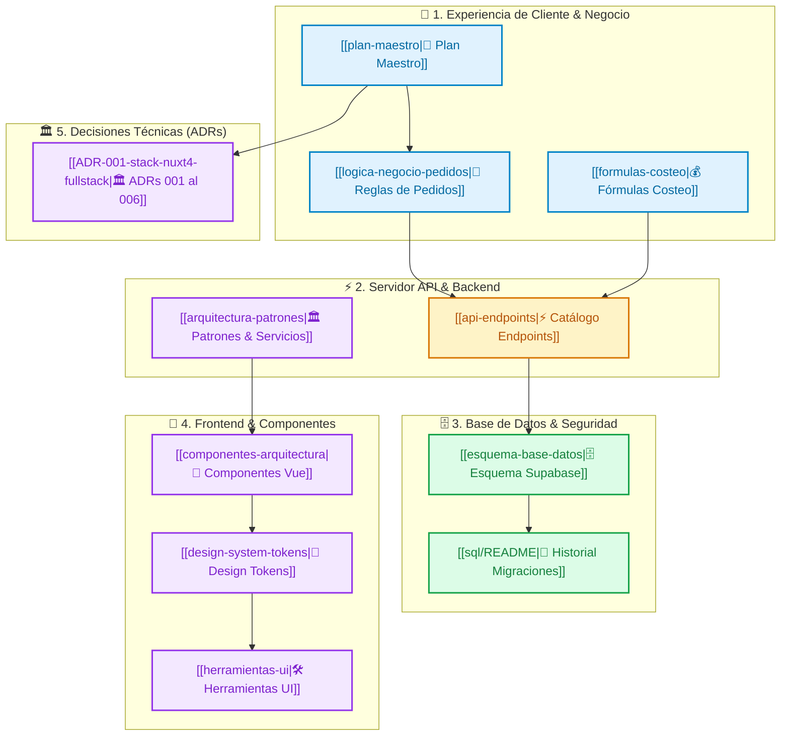

# 🍰 Dulce Fe — Centro de Comando

> **Estado:** 🟢 Fase 1 (Seguridad & RLS) | 🟡 Fase 2 (E-Commerce & ERP)  
> **Vista Gráfica:** Presiona `Ctrl + G` en Obsidian para el mapa global.

---

## 📊 Arquitectura del Ecosistema

---

## 🗂️ Índice de Documentación (Por Carpetas)

### 📁 01 - Estrategia & Negocio
* [[plan-maestro]] — Especificación general, arquitectura Nuxt 4, Guest Checkout y Roadmap.
* [[logica-negocio-pedidos]] — Ciclo de vida de órdenes, estados de cocina KDS y alertas n8n.
* [[formulas-costeo]] — Algoritmos de costeo en gramos/ml, CIF, mano de obra y margen.

### 📁 02 - Backend & Datos
* [[api-endpoints]] — **Catálogo Maestro de Endpoints API** (17 fichas técnicas individuales en `endpoints/`):
  * **Productos:** [[GET-api-products]], [[POST-api-products]], [[GET-api-products-id]], [[PUT-api-products-id]], [[DELETE-api-products-id]], [[POST-api-products-upload]].
  * **Materias Primas:** [[GET-api-raw-materials]], [[POST-api-raw-materials]], [[PUT-api-raw-materials-id]], [[DELETE-api-raw-materials-id]].
  * **Recetas & Excel:** [[GET-api-recipes-productId]], [[POST-api-recipes]], [[DELETE-api-recipes-id]], [[GET-api-recipes-export]].
  * **Carrito:** [[GET-api-cart]], [[POST-api-cart]], [[DELETE-api-cart-productId]].
* [[esquema-base-datos]] — Esquema relacional oficial, tablas `products`, `raw_materials`, `recipe_items`, `orders`, `profiles` y RLS.
* [[sql/README]] — Gobernanza de base de datos y archivo histórico.

### 📁 03 - Arquitectura & UI
* [[architecture-refactor-plan]] — Diagnóstico arquitectónico y plan de refactorización.
* [[arquitectura-patrones]] — Patrones de diseño aplicados y composables.
* [[componentes-arquitectura]] — Guía de estructuración de componentes Vue 3.
* [[design-system-tokens]] — Paleta de colores Dulce Fe, tipografía y bordes.
* [[herramientas-ui]] — Utilidades y librerías de UI (Lucide Icons, Toast, Modal).

### 📁 04 - Informes de Ejecucion
* [[fase-0-informe-ejecucion]] — Auditoría inicial de dependencias y variables de entorno.
* [[fase-1-pr-1a-informe-ejecucion]] — Cierre de vulnerabilidad S1 y desactivación 410 de carrito.
* [[fase-1-pr-1b-informe-ejecucion]] — Guards de servidor `require-user` y `require-admin` en 12 endpoints.
* [[fase-1-pr-1c-informe-ejecucion]] — Blindaje de `isAdmin` en Pinia y migración SQL de RLS en Supabase.
* [[fase-1-pr-1d-informe-ejecucion]] — Upload seguro con Magic Bytes, script `db:types` y suite de tests Vitest.
* [[fase-2-informe-ejecucion]] — Shell Visual, Design System, Layouts `default`/`admin` y Componentes Atómicos UI.

### 📁 05 - Decisiones Técnicas (ADR)
* [[ADR-001-stack-nuxt4-fullstack]] — Monolito Modular Nuxt 4 vs Frontend/Backend separados.
* [[ADR-002-guest-checkout-auth-hibrida]] — Guest Checkout (comprar sin contraseña) para maximizar conversión.
* [[ADR-003-seguridad-rls-supabase-hardening]] — Seguridad RLS en PostgreSQL y blindaje `search_path`.
* [[ADR-004-motor-escandallos-exportacion-exceljs]] — Escandallos en gramos y exportación ExcelJS viva en servidor.
* [[ADR-005-automatizacion-event-driven-n8n]] — Automatizaciones con n8n Open-Source vs Zapier/Make.
* [[ADR-006-carrito-cliente-pinia-cookies]] — Carrito en cliente con Pinia + Cookies vs tablas en BD.

---

## 🛠️ Plantillas del Sistema (`_system/templates/`)
* `_system/templates/TPL-Endpoint.md` — Plantilla para documentar nuevos endpoints.
* `_system/templates/TPL-ADR.md` — Plantilla para registrar nuevos ADRs.
