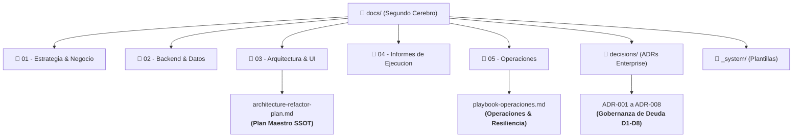

# 🧠 Segundo Cerebro — Base de Conocimiento y Arquitectura Dulce Fe

Bienvenido al **Segundo Cerebro** del proyecto Dulce Fe. Este directorio constituye la Fuente Única de Verdad (*Single Source of Truth* - SSOT) de la arquitectura técnica, reglas de negocio, decisiones de ingeniería, playbooks operativos e informes de ejecución del sistema.

---

## 🗺️ Mapa de Navegación Rápida

---

## 📚 Estructura Detallada por Módulos

### 1. 🎯 [01 - Estrategia & Negocio](./01%20-%20Estrategia%20&%20Negocio/)
* [`plan-maestro.md`](./01%20-%20Estrategia%20&%20Negocio/plan-maestro.md) — Visión de producto, arquitectura general Nuxt 4, Guest Checkout y hoja de ruta.
* [`logica-negocio-pedidos.md`](./01%20-%20Estrategia%20&%20Negocio/logica-negocio-pedidos.md) — Ciclo de vida de órdenes, estados de cocina KDS, tiempos de entrega y alertas.
* [`formulas-costeo.md`](./01%20-%20Estrategia%20&%20Negocio/formulas-costeo.md) — Algoritmos matemáticos de escandallos en gramos/ml, mano de obra, CIF y margen comercial.

### 2. ⚡ [02 - Backend & Datos](./02%20-%20Backend%20&%20Datos/)
* [`api-endpoints.md`](./02%20-%20Backend%20&%20Datos/api-endpoints.md) — Catálogo de 17 endpoints HTTP organizados por dominio (productos, materias primas, recetas, carrito 410, checkout y administración).
* [`esquema-base-datos.md`](./02%20-%20Backend%20&%20Datos/esquema-base-datos.md) — Modelo entidad-relación de PostgreSQL en Supabase, tablas centrales y políticas RLS.

### 3. 🏛️ [03 - Arquitectura & UI](./03%20-%20Arquitectura%20&%20UI/)
* [`architecture-refactor-plan.md`](./03%20-%20Arquitectura%20&%20UI/architecture-refactor-plan.md) — **El Plan Maestro de Arquitectura y Refactorización (SSOT Técnico)**. Contiene las 20 secciones que rigen el proyecto, contratos HTTP (§14), corte S9 (§16), stack de pruebas (§18) y checklist de validación (§20).
* [`checklist-feature-review.md`](./03%20-%20Arquitectura%20&%20UI/checklist-feature-review.md) — Lista de control obligatoria para revisión de features (§10.6): Dominio, Tipado, Validación, Permiso, Prueba y SQL.
* [`design-system-tokens.md`](./03%20-%20Arquitectura%20&%20UI/design-system-tokens.md) — SSOT visual de tokens de diseño, colores institucionales, escala tipográfica y sombras.
* [`componentes-arquitectura.md`](./03%20-%20Arquitectura%20&%20UI/componentes-arquitectura.md) — Lineamientos para estructurar componentes Vue 3 y composables.
* [`arquitectura-patrones.md`](./03%20-%20Arquitectura%20&%20UI/arquitectura-patrones.md) — Patrones de diseño aplicados y guías modulares.
* [`herramientas-ui.md`](./03%20-%20Arquitectura%20&%20UI/herramientas-ui.md) — Catálogo de utilidades de interfaz (Lucide, Toasts, BaseModal).

### 4. 📝 [04 - Informes de Ejecucion](./04%20-%20Informes%20de%20Ejecucion/)
Registro cronológico inmutable de auditorías y entregas por fase:
* **Fase 0:** Línea base técnica y reproducibilidad de plataforma.
* **Fase 1 (PR 1a a 1d):** Cierre de vulnerabilidad S1, guards de autorización en servidor, blindaje Pinia y upload con validación de magic bytes.
* **Fase 2:** Shell visual, Design System tokens y layouts `default` y `admin`.
* **Fase 3 (PR 3a a 3e):** Dominio de dinero en céntimos, checkout concurrente idempotente, corte de seguridad S9 y servicios de dominio.
* **Fase 4 (PR 4a a 4f):** Desacoplamiento modular de dominios UI (Perfil, Catálogo, Insumos, Recetas, Pedidos y Refinamiento 10/10).
* **Fase 5:**
  * [`fase-5-subfase-5.1-eslint-informe.md`](./04%20-%20Informes%20de%20Ejecucion/fase-5-subfase-5.1-eslint-informe.md) — ESLint 10 Flat Config y erradicación total de `any`.
  * [`fase-5-subfase-5.2-limites-arquitectura-informe.md`](./04%20-%20Informes%20de%20Ejecucion/fase-5-subfase-5.2-limites-arquitectura-informe.md) — Linter de límites arquitectónicos (§6.2).
  * [`fase-5-subfase-5.3-ci-type-drift-informe.md`](./04%20-%20Informes%20de%20Ejecucion/fase-5-subfase-5.3-ci-type-drift-informe.md) — Pipeline CI/CD en GitHub Actions y Type Drift Gate.
  * [`fase-5-subfase-5.4-adrs-informe.md`](./04%20-%20Informes%20de%20Ejecucion/fase-5-subfase-5.4-adrs-informe.md) — Formalización de ADRs para las 8 deudas técnicas explícitas.
  * [`fase-5-subfase-5.5-operaciones-informe.md`](./04%20-%20Informes%20de%20Ejecucion/fase-5-subfase-5.5-operaciones-informe.md) — Playbook de operaciones, resiliencia y telemetría.
  * [`fase-5-subfase-5.6-a11y-informe.md`](./04%20-%20Informes%20de%20Ejecucion/fase-5-subfase-5.6-a11y-informe.md) — Accesibilidad WCAG 2.1 AA en formularios y modales.
  * [`fase-5-disciplina-informe-ejecucion.md`](./04%20-%20Informes%20de%20Ejecucion/fase-5-disciplina-informe-ejecucion.md) — **Informe Maestro Consolidado de la Fase 5**.

### 5. 🛡️ [05 - Operaciones](./05%20-%20Operaciones/)
* [`playbook-operaciones.md`](./05%20-%20Operaciones/playbook-operaciones.md) — **Manual Operativo de Misión Crítica**:
  * Matriz de variables por entorno (Dev, Staging, Prod).
  * Procedimiento de rotación de claves Supabase sin downtime.
  * Runbook de Backup y Restore en Staging con sanitización de PII (V44).
  * Despliegue Git-Ops en Vercel y Rollback instantáneo (< 15 segundos).
  * Catálogo de alertas y telemetría de checkout.
  * Incident Response Playbook (IRP) con matriz RACI.

### 6. 🏛️ [decisions/ (Architecture Decision Records)](./decisions/)
Registro de decisiones de arquitectura bajo formato estándar MADR 3.0.0 que documenta la gestión de la deuda técnica explícita (§20.5 D1–D8):
* [`ADR-001`](./decisions/ADR-001-cancellation-stock-reversal.md) — Reversión atómica de stock ante cancelaciones.
* [`ADR-002`](./decisions/ADR-002-guest-order-tracking.md) — Tracking seguro de invitados vía token criptográfico HMAC SHA-256.
* [`ADR-003`](./decisions/ADR-003-pinia-cart-vs-db-cart.md) — Carrito híbrido en Pinia con validación server-side.
* [`ADR-004`](./decisions/ADR-004-catalog-display-stock.md) — Stock visual en catálogo vs. stock real deducido por recetas.
* [`ADR-005`](./decisions/ADR-005-payment-gateways.md) — Evolución de pagos (WhatsApp hacia pasarelas electrónicas).
* [`ADR-006`](./decisions/ADR-006-external-integrations-scope.md) — Límites modulares del monolito vs. servicios desacoplados (n8n/KDS).
* [`ADR-007`](./decisions/ADR-007-completed-order-immutability.md) — Inmutabilidad contractual de pedidos completados.
* [`ADR-008`](./decisions/ADR-008-recipe-versioning.md) — Versionado histórico de recetas y escandallos en ventas pasadas.

### 7. 🛠️ [_system/ (Plantillas y Herramientas)](./_system/)
* [`_system/templates/TPL-Feature-Review.md`](./_system/templates/TPL-Feature-Review.md) — Plantilla para lista de control por feature (Definition of Done).
* [`_system/templates/TPL-ADR.md`](./_system/templates/TPL-ADR.md) — Plantilla para redactar nuevas Decisiones de Arquitectura.
* [`_system/templates/TPL-Endpoint.md`](./_system/templates/TPL-Endpoint.md) — Plantilla estándar para fichas técnicas de API.

---

## 🔍 Centro de Mando Interactivo
* Si utilizas **Obsidian**, puedes abrir [`Dashboard.md`](./Dashboard.md) para un panel de control interactivo o abrir [`sistema-completo.canvas`](./sistema-completo.canvas) para ver el mapa visual completo de relaciones entre código, arquitectura y negocio.
