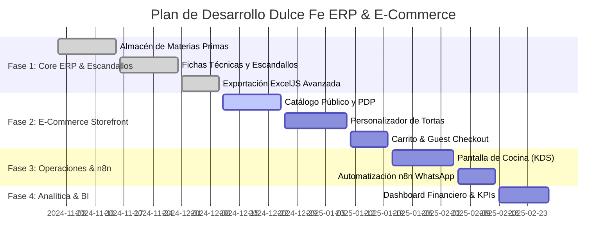

# 📄 PLAN MAESTRO DULCE FE (MASTER BLUEPRINT)
> **Ecosistema Digital de Repostería Artesanal: E-Commerce & ERP Financiero-Operativo**  
> **Versión:** 1.1.0  
> **Estado:** Documento Vivo / Especificación de Arquitectura, Producto y Automatizaciones  
> **Stack Principal:** Nuxt 4 (Vue 3, TypeScript), Tailwind CSS, Supabase (PostgreSQL, Auth, Storage), ExcelJS, `@nuxt/icon` (Lucide Icons), n8n (Automatización Open-Source).

---

## 📋 TABLA DE CONTENIDOS

1. [Visión General y Objetivos Estratégicos](#1-visión-general-y-objetivos-estratégicos)
2. [Arquitectura Tecnológica & Stack de Producción](#2-arquitectura-tecnológica--stack-de-producción)
3. [Diferenciación de Experiencia: Administrador vs. Cliente](#3-diferenciación-de-experiencia-administrador-vs-cliente)
4. [Estrategia de Autenticación & Cuentas de Usuario](#4-estrategia-de-autenticación--cuentas-de-usuario)
5. [MÓDULO A: E-Commerce & Experiencia de Cliente (Storefront Public)](#5-módulo-a-e-commerce--experiencia-de-cliente-storefront-public)
6. [MÓDULO B: ERP Financiero, Costeo & Escandallos (Backend Administrativo)](#6-módulo-b-erp-financiero-costeo--escandallos-backend-administrativo)
7. [MÓDULO C: Operaciones, Producción & Cocina (KDS)](#7-módulo-c-operaciones-producción--cocina-kds)
8. [MÓDULO D: Analítica, Métricas & Business Intelligence](#8-módulo-d-analítica-métricas--business-intelligence)
9. [MÓDULO E: Automatizaciones con n8n & Ecosistema Gratuito/Open-Source](#9-módulo-e-automatizaciones-con-n8n--ecosistema-gratuitoopen-source)
10. [Seguridad, Autenticación & Permisos Granulares (RBAC & RLS)](#10-seguridad-autenticación--permisos-granulares-rbac--rls)
11. [Evolución Arquitectónica & Escalabilidad a Futuro](#11-evolución-arquitectónica--escalabilidad-a-futuro)
12. [Hoja de Ruta & Fases de Implementación (Roadmap)](#12-hoja-de-ruta--fases-de-implementación-roadmap)

---

## 1. VISIÓN GENERAL Y OBJETIVOS ESTRATÉGICOS

### 1.1 El Problema del Sector Repostero
La repostería y pastelería artesanal enfrenta dos grandes desafíos operativos y financieros:
1. **La Paradoja del Escandallo en Gramos/Mililitros:** Los insumos se compran al por mayor (ej. Sacos de Harina de 50kg, Cajas de Mantequilla de 10kg, Esencia de Vainilla de 1L) pero se utilizan en gramos o mililitros para cada receta. Calcular la rentabilidad real de una porción o torta suele hacerse a mano o con estimaciones imprecisas, ocultando pérdidas de dinero.
2. **Desconexión entre Ventas y Producción:** El cliente solicita personalizar un pedido (ej. sabor, número de porciones, temática, relleno), y el equipo de cocina no sabe si el precio cobrado cubre los costos adicionales de mano de obra y empaque especial.

### 1.2 La Solución: Dulce Fe ERP & E-Commerce
Un sistema integral que unifies en una sola plataforma:
- **Una tienda online de alto impacto visual (E-Commerce)** que enamora al cliente, permite personalizar productos y agilizar pedidos directo al WhatsApp o Pasarela de Pagos.
- **Un cerebro financiero (ERP de Escandallos)** que calcula automáticamente el costo exacto de producción por gramo/unidad, suma los costos indirectos (mano de obra, luz, empaques) y garantiza que cada venta deje un **margen bruto y neto positivo y saludable**.

---

## 2. ARQUITECTURA TECNOLÓGICA & STACK DE PRODUCCIÓN

| Capa | Tecnología Seleccionada | Razón Arquitectónica |
| :--- | :--- | :--- |
| **Framework Web** | Nuxt 4 (Vue 3.5 + TypeScript) | SSR para el E-commerce (SEO impecable), SPA reactivo para el panel administrativo, y Server Engine Nitro ultrarrápido (BFF). |
| **Estilos & UI** | Tailwind CSS | Sistema de diseño personalizado, paleta de colores armoniosa, respuesta responsive total. |
| **Base de Datos & Auth** | Supabase (PostgreSQL) | Base de datos relacional sólida con Row Level Security (RLS), autenticación segura y almacenamiento de imágenes. |
| **Reportes & Exportación**| ExcelJS | Generación de libros vivos de Excel (.xlsx) con fórmulas nativas en el servidor sin bloquear el hilo principal. |
| **Iconografía** | `@nuxt/icon` + Lucide Icons | Carga bajo demanda de SVG ultraligeros sin sobrecargar el bundle final. |
| **Motor de Automatización**| n8n (Self-Hosted / Open-Source) | Orquestación de eventos, envíos de WhatsApp, alertas de stock y respaldos sin pagar suscripciones mensuales de Zapier. |

---

## 3. DIFERENCIACIÓN DE EXPERIENCIA: ADMINISTRADOR VS. CLIENTE

Para evitar confusión en el desarrollo y mantener la seguridad estricta del negocio, la aplicación se divide en dos mundos completamente aislados:

```
                          ┌─────────────────────────────────────────┐
                          │         DULCE FE WEB APPLICATION        │
                          └────────────────────┬────────────────────┘
                                               │
                       ┌───────────────────────┴───────────────────────┐
                       ▼                                               ▼
     ┌───────────────────────────────────┐           ┌───────────────────────────────────┐
     │      CLIENTE (E-COMMERCE)         │           │        ADMINISTRADOR (ERP)        │
     │      Acceso Público / Mi Cuenta   │           │      Acceso Privado Protegido     │
     └─────────────────┬─────────────────┘           └─────────────────┬─────────────────┘
                       │                                               │
  • Catálogo interactivo de postres              • Almacén de materias primas & gramos
  • Personalidad de tortas (Customizer)          • Escandallos & Fichas técnicas milimétricas
  • Carrito & Checkout (Guest o Auth)            • Costos Fijos (CIF), Mano de obra y Luz
  • Tracking de pedido vía token                 • Margen de ganancia real y utilidad neto
  • Precios finales de venta en S/               • Pantalla de cocina (KDS) & Estados
  • (JAMÁS ve costos ni insumos)                 • Exportador ExcelJS & Analítica BCG
```

### Tabla Comparativa de Vistas y Responsabilidades

| Dimensión | Vista Cliente (E-Commerce) | Vista Administrador (ERP & Cocina) |
| :--- | :--- | :--- |
| **Ruta URL** | `/` (Home), `/catalogo`, `/personalizar`, `/carrito`, `/pedido/[id]` | `/admin`, `/admin/productos`, `/admin/almacen`, `/admin/recetas`, `/admin/kds` |
| **Visibilidad Financiera** | **Únicamente el precio de venta final.** | **Toda la estructura de costos:** Insumos por gramo, empaques, luz, mano de obra, utilidad neta %. |
| **Requisito de Login** | **Opcional** (Soporta Guest Checkout o Login Social). | **Obligatorio** (Email/Password + Rol de Supabase RLS). |
| **Interacción Principal** | Explorar, personalizar, agregar al carrito y comprar. | Gestionar inventario, crear recetas, controlar producción y analizar métricas. |

---

## 4. ESTRATEGIA DE AUTENTICACIÓN & CUENTAS DE USUARIO

### ¿Es necesario que el cliente cree una cuenta para comprar?
**Respuesta Directa: NO, la cuenta NO será obligatoria para realizar una compra.**

#### Justificación de Negocio (UX / Conversión de Ventas)
En la repostería artesanal, muchas compras son impulsivas o de urgencia (ej. *"Necesito una torta para hoy en la tarde"* o *"Quiero enviar un detalle de aniversario"*). Obligar al cliente a registrarse y confirmar un correo electrónico antes de pagar genera una **fricción alta** que provoca la pérdida de hasta un **40% de las ventas en el carrito**.

#### Estrategia Híbrida Propuesta (Guest Checkout + Registro Opcional)

1. **Modo Invitado (Guest Checkout - Sin Registro):**
   - El cliente agrega productos al carrito o diseña su torta personalizada.
   - En el checkout, solo proporciona: **Nombre, Teléfono (WhatsApp) y Dirección de Entrega**.
   - El sistema genera un **ID de Pedido Único / Token de Rastreo** (ej: `DF-8942`).
   - El cliente puede ver el estado de su pedido en `/pedido/DF-8942` sin necesidad de contraseña.

2. **Modo Cliente Registrado (Opcional - Beneficios de Fidelidad):**
   - Al finalizar la compra, el sistema le ofrece: *"¿Deseas guardar tus datos para tu próxima compra con 1 clic?"*.
   - Login ultrarrápido sin contraseñas difíciles: **Google Auth (1 clic)** o **Magic Link por Email**.
   - **Beneficios del Cliente Registrado:**
     - Historial de pedidos anteriores con botón *"Repetir Pedido"*.
     - Guardado de direcciones frecuentes (Casa, Trabajo, Casa de Pareja).
     - Acumulación de **"Puntos Dulce Fe"** para canjear por descuentos futuros.

---

## 5. MÓDULO A: E-COMMERCE & EXPERIENCIA DE CLIENTE (STOREFRONT PUBLIC)

### 5.1. Landing Page & Branding
- **Hero Section:** Banner promocional dinámico con fotografías de alta resolución, llamado a la acción (CTA) directo: *"Haz tu pedido"* o *"Arma tu torta"*.
- **Propuesta de Valor:** Garantía de insumos premium, frescura, entregas programadas y atención personalizada.
- **Sección de Categorías Rápidas:** Tortas Clásicas, Postres Individuales, Boquitas Dulces/Saladas, Ediciones Especiales.

### 5.2. Catálogo Interactivo & Filtros Avanzados
- **Grid de Productos Dinámico:** Tarjetas de productos con imagen principal, precio desde, etiquetas (Ej: *"Más Vendido"*, *"Sin Gluten"*, *"Para 12 personas"*).
- **Filtros Inteligentes:** Por Ocasión, Número de porciones (6, 12, 20, 30 porciones) y Rango de Precio.
- **Vista Detallada del Producto (PDP):** Galería de imágenes, selección de tamaño/porciones con actualización inmediata de precio, selección de sabores y campo para mensaje personalizado.

### 5.3. Personalizador de Tortas (Custom Cake Builder)
Wizard interactivo paso a paso:
1. **Paso 1 - Tamaño y Forma:** Redonda, Cuadrada, Pisos (1, 2 o 3 pisos), número de invitados.
2. **Paso 2 - Bizcocho:** Vainilla, Chocolate Velvet, Red Velvet, Zanahoria, Maracuyá.
3. **Paso 3 - Rellenos:** Fudge artesanal, Manjarblanco, Frutos Rojos, Crema Pastelera.
4. **Paso 4 - Cubierta & Estilo:** Buttercream, Fondant, Ganache, Naked Cake.
5. **Paso 5 - Adicionales & Toppers:** Flores naturales, topper acrílico, fotos comestibles.
6. **Paso 6 - Cotización Automática y Resumen en Tiempo Real.**

### 5.4. Carrito de Compras & Checkout
- **Side Cart (Drawer):** Accesible en todo momento para ajustar cantidades.
- **Checkout optimizado (Guest / Auth):** Recojo en tienda o delivery con calculador de zona, seleccionador de fecha/hora de entrega (con bloqueo de días agotados) y pago vía Yape/Plin, Tarjeta o WhatsApp.

### 5.5. Tracking de Pedidos en Tiempo Real
- Vista pública `/pedido/[orderId]` con barra de estado visual: `Recibido` ➔ `En Cocina` ➔ `En Decoración` ➔ `Listo` ➔ `Entregado`.

---

## 6. MÓDULO B: ERP FINANCIERO, COSTEO & ESCANDALLOS (BACKEND ADMINISTRATIVO)

### 6.1. Almacén & Gestión de Materias Primas (`AdminMaterialsTab.vue`)
- Registro de compras por volumen (sacos, baldes, cajas, litros).
- **Cálculo automático de costo unitario por gramo/mililitro:**
  $$\text{Costo Unitario} = \frac{\text{Precio Pagado por Paquete}}{\text{Cantidad Total en Unidad Mínima}}$$
- Alertas de stock mínimo.

### 6.2. Fichas Técnicas & Escandallos (`AdminRecipesTab.vue`)
- Relación exacta del producto con sus insumos.
- Cálculo automático de costos parciales de ingredientes.

### 6.3. Motor de Costos Indirectos de Fabricación (CIF)
- Imputación obligatoria de: **Empaques/Cajas**, **Servicios (Luz/Agua/Gas)** y **Mano de Obra Directa (MOD)**.

### 6.4. Calculadora & Simulador de Margen de Rentabilidad
- **Costo Total de Producción:**
  $$\text{Costo Total Producción} = \sum (\text{Costos Parciales Insumos}) + \text{Empaque} + \text{Servicios (CIF)} + \text{Mano de Obra}$$
- **Margen Bruto de Ganancia (S/ y %):**
  $$\text{Margen Bruto (S/)} = \text{Precio Venta} - \text{Costo Total Producción}$$
- Alertas de color (Verde > 45%, Amarillo 25-44%, Rojo < 25%).

### 6.5. Exportador Vivo a Microsoft Excel (ExcelJS)
- `/api/recipes/export.get.ts` genera libros `.xlsx` con **fórmulas dinámicas vivas de Excel**.

---

## 7. MÓDULO C: OPERACIONES, PRODUCCIÓN & COCINA (KDS)

- **KDS (Kitchen Display System):** Interfaz para tablets en cocina ordenada por fecha de entrega prioritaria.
- **Gestión de Estados:** Cambio de estado del pedido con 1 toque.
- **Deducción Automática de Stock:** El almacén descuenta gramos/ml al iniciar producción.
- **Control de Mermas:** Registro de productos o insumos dañados.

---

## 8. MÓDULO D: ANALÍTICA, MÉTRICAS & BUSINESS INTELLIGENCE

- **Dashboard Ejecutivo:** Ventas totales, Utilidad bruta, Ticket promedio.
- **Alertas de Inflación:** Control de alzas de precio en harina, mantequilla, chocolate, etc.
- **Matriz BCG de Repostería:** Clasificación de productos Estrella, Vacas lecheras, Incógnitas y Perros.

---

## 9. MÓDULO E: AUTOMATIZACIONES CON N8N & ECOSISTEMA GRATUITO/OPEN-SOURCE

Para lograr un sistema verdaderamente moderno y automatizado sin pagar tarifas mensuales altas (como Zapier o Make), integráremos **n8n** (Self-Hosted en Render/Railway o VPS local gratis).

```
   ┌───────────────────┐            ┌───────────────────┐            ┌───────────────────┐
   │  SUPABASE / NUXT  │ ─────────► │    ENGINE N8N     │ ─────────► │ CANAL EXTERNO     │
   │  Evento en la BD  │  Webhook   │  Flujo Automático │   API      │ (WhatsApp/Correo) │
   └───────────────────┘            └───────────────────┘            └───────────────────┘
```

### Flujos de Automatización Clave en n8n:

1. **Notificación de Confirmación de Pedido (WhatsApp):**
   - *Detonante:* Nuevo pedido registrado en la tabla `orders` de Supabase.
   - *Acción n8n:* Genera mensaje amigable y lo envía al WhatsApp del cliente con su enlace de rastreo `/pedido/DF-XXXX`.

2. **Notificación de Estado en Cocina (WhatsApp):**
   - *Detonante:* El pastelero cambia el estado a `Listo para Recojo` o `En Camino`.
   - *Acción n8n:* Envía alerta instantánea al cliente: *"¡Tu torta está lista para ser recogida!"*.

3. **Alerta de Stock Crítico de Insumos (Telegram / WhatsApp Administrador):**
   - *Detonante:* El stock de un ingrediente cae por debajo del stock mínimo.
   - *Acción n8n:* Envía mensaje al grupo de compras: *"⚠️ ATENCIÓN: Quedan solo 500g de Mantequilla en Almacén"*.

4. **Resumen Diario de Ventas & Utilidades (10:00 PM):**
   - *Detonante:* Cron Job programado todas las noches.
   - *Acción n8n:* Ejecuta consulta a la API, consolida las ventas del día, costo total e ingresos netos, y genera un reporte en PDF/Mensaje para los dueños.

---

## 10. SEGURIDAD, AUTENTICACIÓN & PERMISOS GRANULARES (RBAC & RLS)

- **Roles Definidos:** `SuperAdmin`, `Ventas/Recepción`, `Pastelero/Cocina`, `Cliente`.
- **Row Level Security (RLS) en Supabase:**
  - Tablas de costos (`raw_materials`, `recipe_items`, `cif_costs`) protegidas para que solo usuarios con JWT con rol `admin` puedan leer/escribir.
  - El cliente solo puede consultar productos activos y sus propios pedidos.

---

## 11. EVOLUCIÓN ARQUITECTÓNICA & ESCALABILIDAD A FUTURO

### ¿Debemos separar el Frontend del Backend ahora o en el futuro?

#### Estado Actual (Fase 1 a 3): Monolito Modular Elegante (Nuxt 4 Fullstack)
- **Estructura:** Nuxt 4 actúa como tienda SSR frontend y como Backend API (BFF) a través de sus endpoints `/server/api/` con Nitro Engine.
- **Ventaja:** **Desarrollo ultra veloz, despliegue único, 0 latencia entre front y back**, costo de servidor casi gratuito en Vercel/Netlify + Supabase Free Tier.

#### Evolución Futura (Fase 4+ / Cuando la empresa escale masivamente):
Si a futuro el negocio requiere:
1. Crear una **App Móvil Nativa (iOS / Android en Flutter o React Native)** para los repartidores o clientes.
2. Integrarse con sistemas POS físicos de tiendas retail.

**Estrategia de Transición:**
- **La Base de Datos (Supabase) ya está desacoplada:** No cambiará.
- **Nitro API se independiza:** Los endpoints de `/server/api/` se pueden convertir en un microservicio de API REST/GraphQL en TypeScript puro.
- **Storefront Web:** Continuará consumiendo la misma API sin reescribir la lógica de interfaz.

---

## 12. HOJA DE RUTA & FASES DE IMPLEMENTACIÓN (ROADMAP)



---

### 📌 Documentos Complementarios en `/docs`
1. **[plan-maestro.md](file:///c:/Users/PRUEBA/Documents/Visual%20Proyects/Fullstack-dulcefe/docs/plan-maestro.md):** Especificación de producto, visión y roadmap.
2. **[arquitectura-patrones.md](file:///c:/Users/PRUEBA/Documents/Visual%20Proyects/Fullstack-dulcefe/docs/arquitectura-patrones.md):** Guía profunda de arquitectura de software, patrones de diseño y flujo de datos.
3. **[formulas-costeo.md](file:///c:/Users/PRUEBA/Documents/Visual%20Proyects/Fullstack-dulcefe/docs/formulas-costeo.md):** Algoritmos y fórmulas matemáticas para el escandallo.
4. **[componentes-arquitectura.md](file:///c:/Users/PRUEBA/Documents/Visual%20Proyects/Fullstack-dulcefe/docs/componentes-arquitectura.md):** Estructura y convenciones de componentes Vue 3.
